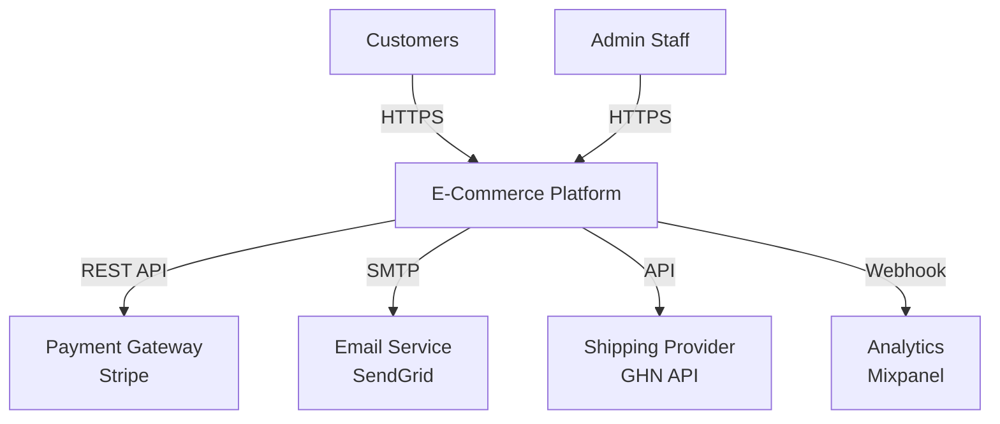
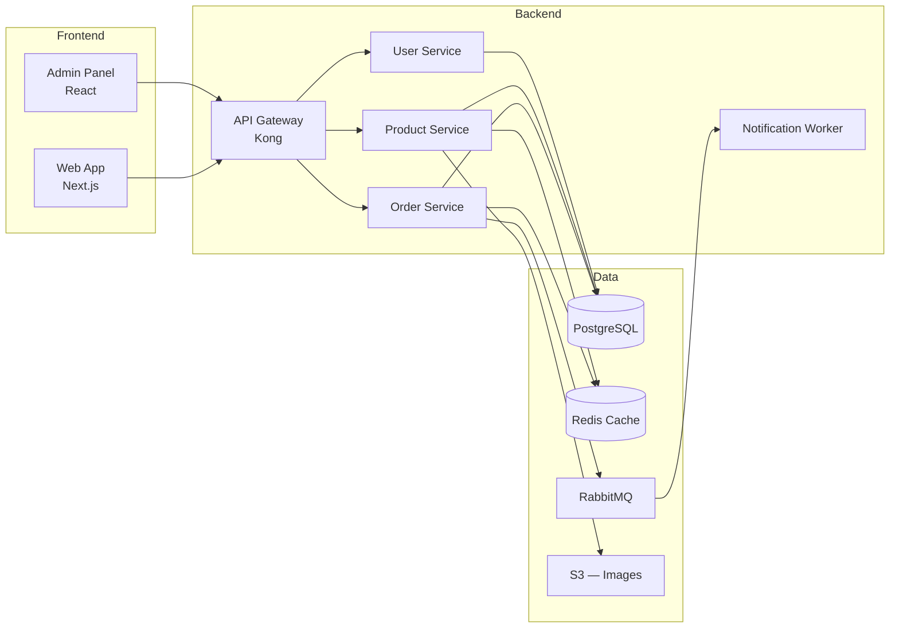
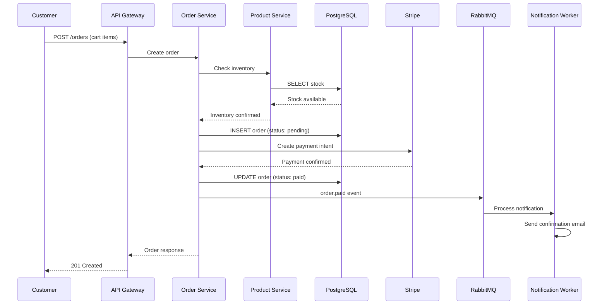
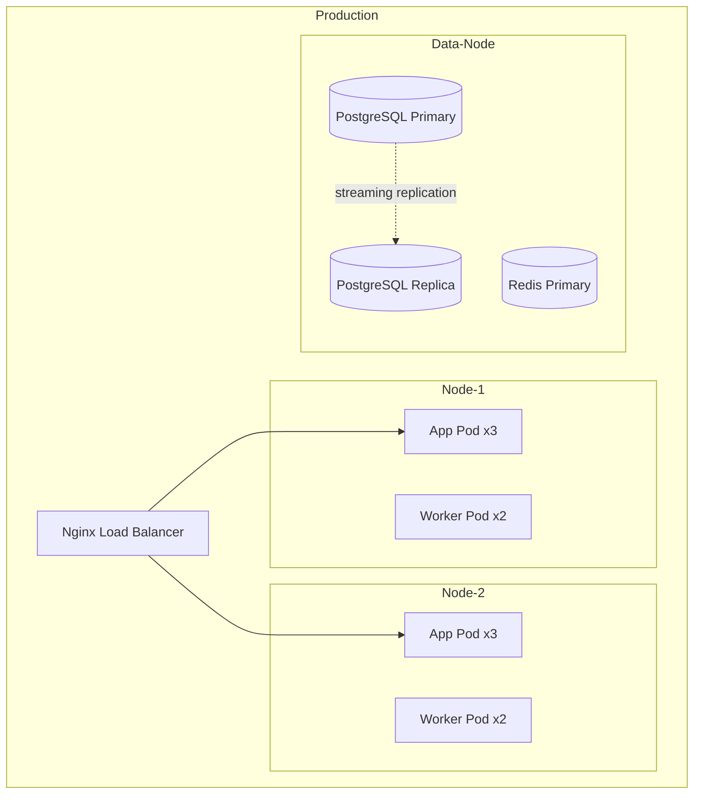
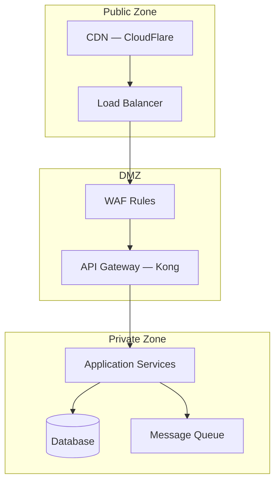

# E-Commerce Platform — Architecture

!!! info "Document Metadata"
    | Field | Value |
    |-------|-------|
    | **Owner** | Platform Team |
    | **Status** | Approved |
    | **Last reviewed** | 2026-03-30 |
    | **Scope** | Full platform architecture — order flow focus |

## Context Diagram

High-level view: how the platform interacts with users and external systems.

| Actor / System | Interaction | Protocol | Notes |
|----------------|-------------|----------|-------|
| Customers | Browse, order, payment | HTTPS | Web + Mobile responsive |
| Admin Staff | Manage products, orders | HTTPS | Internal admin panel |
| Stripe | Payment processing | REST API | PCI-DSS compliant |
| SendGrid | Transactional emails | SMTP/API | Order confirmation, shipping updates |
| GHN API | Shipping tracking | REST API | Vietnam domestic shipping |

## Component Diagram

Internal components and how they communicate.

| Component | Responsibility | Technology | Owner |
|-----------|---------------|------------|-------|
| API Gateway | Routing, rate limiting, auth | Kong 3.x | Platform Team |
| Order Service | Order lifecycle, checkout | Node.js (Express) | Order Team |
| Product Service | Catalog, inventory, search | Node.js (Express) | Product Team |
| User Service | Auth, profiles, addresses | Node.js (Express) | Platform Team |
| Notification Worker | Email, SMS, push notifications | Node.js | Platform Team |
| PostgreSQL | Persistent storage | PostgreSQL 16 | DBA Team |
| Redis | Cache, session, rate limiting | Redis 7.2 | Platform Team |

## Data Flow

How data moves through the system for the checkout flow.

| Flow | Trigger | Path | SLA |
|------|---------|------|-----|
| Checkout | Customer places order | Customer -> Gateway -> Order -> Product -> DB -> Stripe | < 3s end-to-end |
| Order notification | Payment confirmed | Order -> Queue -> Worker -> SendGrid | < 30s after payment |
| Inventory sync | Product update | Admin -> Product -> DB -> Cache invalidation | < 1s cache refresh |

## Technology Stack

| Layer | Technology | Version | Purpose |
|-------|-----------|---------|---------|
| Frontend | Next.js | 14.x | SSR + static pages for SEO |
| Admin UI | React + Ant Design | 18.x | Internal management dashboard |
| Backend | Node.js + Express | 20 LTS | API services |
| Database | PostgreSQL | 16 | Primary data store |
| Cache | Redis | 7.2 | Session, product cache, rate limiting |
| Queue | RabbitMQ | 3.13 | Async event processing |
| Storage | MinIO (S3-compatible) | latest | Product images |
| Infrastructure | Docker + K8s | 1.29 | Container orchestration |

## Deployment View

| Environment | Instances | Region | Notes |
|-------------|-----------|--------|-------|
| Production | 3 nodes K8s | `<REGION>` | Auto-scaling 3-6 app pods |
| Staging | 1 node K8s | `<REGION>` | Mirrors prod config |
| Development | Docker Compose | Local | Single-node all services |

## Security Boundaries

| Boundary | Controls | Notes |
|----------|----------|-------|
| Public -> DMZ | CloudFlare WAF, DDoS protection, TLS 1.3 | Rate limit: 100 req/min per IP |
| DMZ -> Private | Kong auth, JWT validation, network ACL | Service mesh with mTLS |
| Data at rest | AES-256 encryption | PostgreSQL TDE + S3 SSE |
| Secrets | HashiCorp Vault | Auto-rotation every 90 days |
