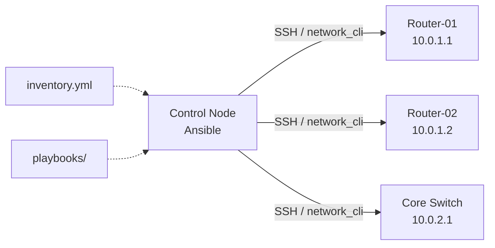

# Hướng dẫn sử dụng Ansible cho Network Automation

> **Build log:** Doc này được tạo theo v4.0.0 workflow — dùng `prompts/create-howto.md` + `project-doc-writer` skill + `ops-runbook-writer` Iron Law cho network commands.

!!! info "Về guide này"
    **Skill áp dụng:** `project-doc-writer` (how-to structure) + `ops-runbook-writer` (commands + expected output)
    **Template:** T3 How-to Guide
    **Audience:** Network Engineer / Junior SysAdmin — biết Linux cơ bản, chưa dùng Ansible

---

## Prerequisites

Trước khi bắt đầu, đảm bảo có đủ:

- [ ] Python 3.8+ trên control node: `python3 --version` → `Python 3.8.x` hoặc cao hơn
- [ ] SSH access vào ít nhất 1 thiết bị Cisco IOS/IOS-XE
- [ ] Tài khoản có quyền `enable` trên thiết bị mạng
- [ ] Quyền `sudo` trên máy control node (Linux/macOS)
- [ ] Đã test SSH thủ công thành công: `ssh netadmin@10.0.1.1`

!!! warning "Test trên lab trước"
    Luôn test playbook trên môi trường lab/staging trước production. Một playbook sai có thể disconnect toàn bộ thiết bị mạng.

!!! danger "Không hardcode credentials"
    Dùng Ansible Vault cho mọi password và sensitive data. Xem Step 3.2.

---

## Tổng quan kiến trúc



| Thành phần | Vai trò | Ghi chú |
|---|---|---|
| Control Node | Máy chạy Ansible | Không cần cài gì trên thiết bị mạng |
| Inventory | Danh sách thiết bị, credentials | `inventory/hosts.yml` |
| Playbook | Tập lệnh tự động hóa | `playbooks/*.yml` |
| Connection | `network_cli` | Dùng SSH, không cần Python trên thiết bị |

---

## Step 1: Cài đặt Ansible và network collections

### 1.1 Cài Ansible

```bash
pip3 install ansible ansible-lint
```

**Expected result:**

```
Successfully installed ansible-9.x.x ansible-core-2.x.x ansible-lint-x.x.x
```

### 1.2 Cài Cisco IOS collection

```bash
ansible-galaxy collection install cisco.ios
```

**Expected result:**

```
Starting galaxy collection install process
cisco.ios 6.x.x was installed successfully
```

### 1.3 Verify cài đặt

```bash
ansible --version
ansible-galaxy collection list | grep cisco
```

**Expected result:**

```
ansible [core 2.x.x]
  python version = 3.x.x

# Collection list:
cisco.ios    6.x.x
```

!!! tip "Dùng virtual environment"
    ```bash
    python3 -m venv ansible-env
    source ansible-env/bin/activate
    pip install ansible ansible-lint cisco.ios
    ```

---

## Step 2: Tạo cấu trúc project

```bash
mkdir -p ansible-network/{inventory,playbooks,group_vars/all}
cd ansible-network
```

**Expected result:**

```
ansible-network/
├── inventory/
├── playbooks/
└── group_vars/
    └── all/
```

### 2.1 Tạo ansible.cfg

```bash
cat > ansible.cfg << 'EOF'
[defaults]
inventory = inventory/hosts.yml
host_key_checking = False
timeout = 30

[persistent_connection]
connect_timeout = 30
command_timeout = 30
EOF
```

**Expected result:** File `ansible.cfg` được tạo, không có error output.

---

## Step 3: Cấu hình Inventory và Vault

### 3.1 Tạo `inventory/hosts.yml`

```yaml
all:
  children:
    cisco_routers:
      hosts:
        router-01:
          ansible_host: 10.0.1.1
        router-02:
          ansible_host: 10.0.1.2
      vars:
        ansible_network_os: cisco.ios.ios
        ansible_connection: network_cli
        ansible_user: netadmin
        ansible_password: "{{ vault_device_password }}"
        ansible_become: true
        ansible_become_method: enable
        ansible_become_password: "{{ vault_enable_password }}"

    core_switches:
      hosts:
        sw-core-01:
          ansible_host: 10.0.2.1
      vars:
        ansible_network_os: cisco.ios.ios
        ansible_connection: network_cli
        ansible_user: netadmin
        ansible_password: "{{ vault_device_password }}"
```

### 3.2 Setup Ansible Vault cho credentials

```bash
# Tạo vault file
ansible-vault create group_vars/all/vault.yml
# Nhập password vault khi được hỏi
# Thêm nội dung:
# vault_device_password: "password_thiet_bi"
# vault_enable_password: "enable_password"
```

**Expected result:**

```
New Vault password:
Confirm New Vault password:
# File group_vars/all/vault.yml được tạo (encrypted)
```

### 3.3 Verify inventory

```bash
ansible-inventory --list -y --ask-vault-pass
```

**Expected result:**

```yaml
all:
  children:
    cisco_routers:
      hosts:
        router-01:
          ansible_host: 10.0.1.1
          ansible_network_os: cisco.ios.ios
          ...
    core_switches:
      hosts:
        sw-core-01: ...
```

---

## Step 4: Playbook cơ bản — Gather Facts

### 4.1 Tạo `playbooks/gather-facts.yml`

```yaml
---
- name: Gather network device facts
  hosts: all
  gather_facts: false

  tasks:
    - name: Collect device facts
      cisco.ios.ios_facts:
        gather_subset:
          - hardware
          - interfaces

    - name: Show device summary
      ansible.builtin.debug:
        msg:
          - "Host: {{ inventory_hostname }}"
          - "Hostname: {{ ansible_net_hostname }}"
          - "Model: {{ ansible_net_model }}"
          - "IOS Version: {{ ansible_net_version }}"
```

### 4.2 Chạy và verify

```bash
ansible-playbook playbooks/gather-facts.yml --ask-vault-pass
```

**Expected result:**

```
PLAY [Gather network device facts] *******

TASK [Collect device facts] **************
ok: [router-01]
ok: [router-02]
ok: [sw-core-01]

TASK [Show device summary] ***************
ok: [router-01] =>
  msg:
    - 'Host: router-01'
    - 'Hostname: RTR01-HN-DC'
    - 'Model: Cisco ISR4451'
    - 'IOS Version: 16.12.3'

PLAY RECAP *******************************
router-01  : ok=2  changed=0  failed=0
router-02  : ok=2  changed=0  failed=0
sw-core-01 : ok=2  changed=0  failed=0
```

---

## Step 5: Playbook thực tế — Backup Config

### 5.1 Tạo `playbooks/backup-config.yml`

```yaml
---
- name: Backup running configuration
  hosts: all
  gather_facts: false

  vars:
    backup_dir: "backups/{{ lookup('pipe', 'date +%Y-%m-%d') }}"

  tasks:
    - name: Create backup directory
      ansible.builtin.file:
        path: "{{ backup_dir }}"
        state: directory
        mode: "0755"
      delegate_to: localhost
      run_once: true

    - name: Get running config
      cisco.ios.ios_command:
        commands: show running-config
      register: running_config

    - name: Save config to file
      ansible.builtin.copy:
        content: "{{ running_config.stdout[0] }}"
        dest: "{{ backup_dir }}/{{ inventory_hostname }}.cfg"
        mode: "0644"
      delegate_to: localhost

    - name: Confirm backup size
      ansible.builtin.stat:
        path: "{{ backup_dir }}/{{ inventory_hostname }}.cfg"
      register: backup_stat
      delegate_to: localhost

    - name: Report
      ansible.builtin.debug:
        msg: "Backed up {{ inventory_hostname }}: {{ backup_stat.stat.size }} bytes"
```

### 5.2 Chạy backup

```bash
ansible-playbook playbooks/backup-config.yml --ask-vault-pass
```

**Expected result:**

```
PLAY RECAP *******************************
router-01  : ok=5  changed=2  failed=0
router-02  : ok=5  changed=2  failed=0
sw-core-01 : ok=5  changed=2  failed=0

# Verify files:
ls -la backups/2026-03-30/
# router-01.cfg  router-02.cfg  sw-core-01.cfg
```

---

## Step 6: Playbook nâng cao — Deploy VLAN

!!! warning "Backup trước khi deploy"
    Playbook này tự động backup config trước khi thay đổi. Verify backup tồn tại trước khi tiếp tục.

### 6.1 Tạo `playbooks/deploy-vlan.yml`

```yaml
---
- name: Deploy VLAN to core switches
  hosts: core_switches
  gather_facts: false

  vars:
    vlan_id: 100
    vlan_name: "DATA-USERS"

  pre_tasks:
    - name: Backup config before change
      cisco.ios.ios_command:
        commands: show running-config
      register: pre_config

    - name: Save pre-change backup
      ansible.builtin.copy:
        content: "{{ pre_config.stdout[0] }}"
        dest: "backups/pre-{{ inventory_hostname }}-{{ lookup('pipe', 'date +%s') }}.cfg"
      delegate_to: localhost

  tasks:
    - name: Create VLAN
      cisco.ios.ios_vlans:
        config:
          - vlan_id: "{{ vlan_id }}"
            name: "{{ vlan_name }}"
            state: active
        state: merged

    - name: Verify VLAN created
      cisco.ios.ios_command:
        commands: "show vlan id {{ vlan_id }}"
      register: vlan_check

    - name: Assert VLAN exists
      ansible.builtin.assert:
        that:
          - "'{{ vlan_id }}' in vlan_check.stdout[0]"
          - "'active' in vlan_check.stdout[0]"
        fail_msg: "VLAN {{ vlan_id }} creation FAILED"
        success_msg: "VLAN {{ vlan_id }} created OK"

  post_tasks:
    - name: Save running config
      cisco.ios.ios_command:
        commands: write memory
      register: save_result

    - name: Confirm save
      ansible.builtin.debug:
        msg: "{{ save_result.stdout[0] }}"
```

**Expected result khi PASS:**

```
TASK [Assert VLAN exists] ****************
ok: [sw-core-01] =>
  msg: VLAN 100 created OK

TASK [Save running config] ***************
ok: [sw-core-01] =>
  msg: "Building configuration...\n[OK]"

PLAY RECAP *******************************
sw-core-01 : ok=6  changed=2  failed=0
```

---

## Verify

Sau khi chạy xong, verify bằng các lệnh sau:

```bash
# 1. Verify backups tồn tại và có dung lượng hợp lý
ls -lh backups/2026-03-30/
# Expected: mỗi file ≥ 1KB

# 2. Verify VLAN trên switch (ad-hoc command)
ansible core_switches -m cisco.ios.ios_command \
  -a "commands='show vlan brief'" \
  --ask-vault-pass

# Expected output:
# VLAN Name          Status    Ports
# ---- ------------- --------- ----
# 1    default        active    Gi0/0
# 100  DATA-USERS     active

# 3. Diff config trước/sau thay đổi
diff backups/pre-sw-core-01-*.cfg backups/2026-03-30/sw-core-01.cfg
```

---

## Troubleshooting

??? warning "Error: `Connection timed out`"
    **Triệu chứng:** `fatal: [router-01]: FAILED! => {"msg": "timed out"}`

    **Nguyên nhân:** SSH không reach được thiết bị, hoặc timeout quá ngắn.

    **Fix:**
    ```bash
    # Test SSH thủ công
    ssh -v netadmin@10.0.1.1

    # Tăng timeout trong ansible.cfg
    [persistent_connection]
    connect_timeout = 60
    command_timeout = 60
    ```

??? warning "Error: `Invalid credentials` / `Authentication failed`"
    **Triệu chứng:** `Authentication failed` hoặc `Permission denied`

    **Nguyên nhân:** Password trong vault sai hoặc user chưa tồn tại.

    **Fix:**
    ```bash
    # Test connection với verbose
    ansible router-01 -m ping -vvv --ask-vault-pass

    # Re-encrypt vault nếu cần
    ansible-vault rekey group_vars/all/vault.yml
    ```

??? warning "Error: `Module not found: cisco.ios.ios_facts`"
    **Triệu chứng:** `ERROR! couldn't resolve module 'cisco.ios.ios_facts'`

    **Nguyên nhân:** Collection chưa cài hoặc cài sai environment.

    **Fix:**
    ```bash
    ansible-galaxy collection install cisco.ios --force
    ansible-galaxy collection list | grep cisco.ios
    ```

??? warning "Error: `assert failed — VLAN not found`"
    **Triệu chứng:** `VLAN 100 creation FAILED`

    **Nguyên nhân:** Device không support `ios_vlans` module (IOS version quá cũ).

    **Fix:** Dùng `ios_command` thay thế:
    ```yaml
    - name: Create VLAN (legacy)
      cisco.ios.ios_command:
        commands:
          - "vlan {{ vlan_id }}"
          - "name {{ vlan_name }}"
          - "exit"
    ```

---

## Next Steps

- Ansible Vault — quản lý secrets nâng cao
- Network Topology Documentation — dùng `docs-toolkit new network` để tạo
- Scheduled backup via cron + Git version control cho backup files

---

> **Version:** 4.0.0 | **Updated:** 2026-03-30
> **Build method:** v4.0.0 AI-Agent workflow — `prompts/create-howto.md` + `project-doc-writer` + `ops-runbook-writer` Iron Law