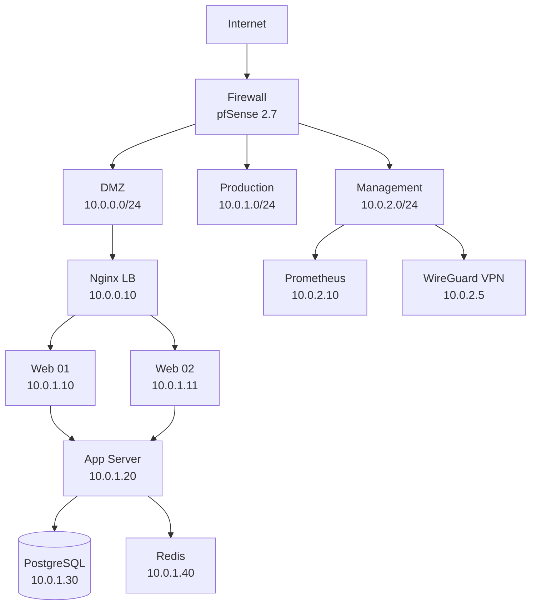

# Network Documentation: Demo Lab

## Topology Diagram

## VLAN Layout

| VLAN ID | Name       | Subnet       | Gateway    | Purpose              |
| ------- | ---------- | ------------ | ---------- | -------------------- |
| 10      | DMZ        | 10.0.0.0/24  | 10.0.0.1   | Public-facing (LB)   |
| 20      | Production | 10.0.1.0/24  | 10.0.1.1   | App servers + DB     |
| 30      | Management | 10.0.2.0/24  | 10.0.2.1   | Admin + monitoring   |

## Server Inventory

| Hostname   | IP        | OS           | Role              | VLAN | Owner |
| ---------- | --------- | ------------ | ----------------- | ---- | ----- |
| lb-01      | 10.0.0.10 | Ubuntu 22.04 | Nginx LB          | 10   | Infra |
| web-01     | 10.0.1.10 | Ubuntu 22.04 | Nginx + Node.js   | 20   | Dev   |
| web-02     | 10.0.1.11 | Ubuntu 22.04 | Nginx + Node.js   | 20   | Dev   |
| app-01     | 10.0.1.20 | Ubuntu 22.04 | Application server | 20   | Dev   |
| db-primary | 10.0.1.30 | Ubuntu 22.04 | PostgreSQL 16      | 20   | DBA   |
| cache-01   | 10.0.1.40 | Ubuntu 22.04 | Redis 7            | 20   | Dev   |
| mon-01     | 10.0.2.10 | Ubuntu 22.04 | Prometheus+Grafana | 30   | Infra |
| vpn-gw     | 10.0.2.5  | Ubuntu 22.04 | WireGuard VPN      | 30   | Infra |

## Firewall Rules Summary

| #   | Source    | Dest       | Port | Protocol | Action | Note            |
| --- | --------- | ---------- | ---- | -------- | ------ | --------------- |
| 1   | Internet  | DMZ LB     | 443  | TCP      | ALLOW  | HTTPS only      |
| 2   | Internet  | DMZ LB     | 80   | TCP      | ALLOW  | HTTP (redirect) |
| 3   | DMZ LB    | PROD Web   | 8080 | TCP      | ALLOW  | Reverse proxy   |
| 4   | PROD Web  | PROD App   | 3000 | TCP      | ALLOW  | API calls       |
| 5   | PROD App  | PROD DB    | 5432 | TCP      | ALLOW  | PostgreSQL      |
| 6   | PROD App  | PROD Cache | 6379 | TCP      | ALLOW  | Redis           |
| 7   | MGMT      | ALL VLANs  | 22   | TCP      | ALLOW  | SSH admin       |
| 8   | MGMT Mon  | ALL VLANs  | 9100 | TCP      | ALLOW  | Node exporter   |
| 9   | VPN       | MGMT       | ALL  | ALL      | ALLOW  | VPN admin       |
| 10  | ANY       | ANY        | ANY  | ANY      | DENY   | Default deny    |

## Certificate Register

| Domain              | Issuer        | Expiry     | Auto-renew | Owner |
| ------------------- | ------------- | ---------- | ---------- | ----- |
| app.demo-lab.local  | Let's Encrypt | 2026-06-15 | Yes        | Infra |
| api.demo-lab.local  | Let's Encrypt | 2026-06-15 | Yes        | Infra |
| mon.demo-lab.local  | Self-signed   | 2027-03-26 | No         | Infra |

## DNS Records (Critical)

| Record              | Type  | Value     | TTL |
| ------------------- | ----- | --------- | --- |
| app.demo-lab.local  | A     | 10.0.0.10 | 300 |
| api.demo-lab.local  | A     | 10.0.0.10 | 300 |
| db.demo-lab.local   | A     | 10.0.1.30 | 300 |
| mon.demo-lab.local  | A     | 10.0.2.10 | 300 |
