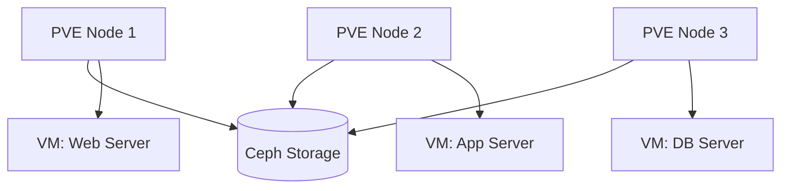

# :material-book-cog: Runbook: Proxmox VM Management

!!! info "Last verified: 2026-03-26 | Owner: Infrastructure Team"

## Overview

| Field           | Value                     |
| --------------- | ------------------------- |
| **Service**     | Proxmox VE Cluster        |
| **Environment** | :material-server: production |
| **URL**         | `https://pve.example.com` |
| **Version**     | Proxmox VE 8.x            |



## Health Checks

| Check          | Command                                 | Expected           | Alert If           |
| -------------- | --------------------------------------- | ------------------ | ------------------ |
| Cluster status | `pvecm status`                          | `Quorate: Yes`     | Quorate: No        |
| Node status    | `pvesh get /nodes --output-format json` | All nodes "online" | Any node "offline" |
| VM running     | `qm list \| grep running`               | All critical VMs   | Missing VM         |
| Storage usage  | `pvesm status`                          | Used < 80%         | Used > 85%         |
| Ceph health    | `ceph status`                           | `HEALTH_OK`        | HEALTH_WARN/ERR    |

## Common Tasks

### Create VM từ template

```bash
# Clone từ template (ID 9000) → VM mới (ID 200)
qm clone 9000 200 --name "new-web-server" --full true --storage local-lvm

# Cấu hình resources
qm set 200 --cores 4 --memory 8192 --net0 virtio,bridge=vmbr0,tag=20

# Start VM
qm start 200

# Verify
qm status 200
# Expected: status: running
```

### Snapshot Management

```bash
# Tạo snapshot trước maintenance
qm snapshot 200 "pre-upgrade-$(date +%Y%m%d)" --description "Before OS upgrade"

# List snapshots
qm listsnapshot 200

# Rollback (⚠️ VM phải stop trước)
qm stop 200
qm rollback 200 "pre-upgrade-20260326"
qm start 200
```

### VM Migration (live)

```bash
# Live migrate VM 200 sang node pve2
qm migrate 200 pve2 --online

# Verify
qm status 200
# Expected: node: pve2, status: running
```

## Backup & Restore

```bash
# Manual backup
vzdump 200 --storage backup-nfs --mode snapshot --compress zstd

# Schedule backup (trong /etc/pve/jobs.cfg)
# Tự động backup tất cả VMs lúc 2AM hàng ngày

# Restore từ backup
qmrestore /mnt/backup/vzdump-qemu-200-*.vma.zst 201 --storage local-lvm
```

## Troubleshooting

### Issue: VM không start được

??? warning "Symptoms: `qm start 200` → TASK ERROR"
    **Root Cause:** Thường do thiếu storage hoặc lock file

    **Fix:**

    ```bash
    # Check lý do
    qm config 200 | grep lock
    # Nếu có lock → unlock
    qm unlock 200

    # Check storage
    pvesm status
    # Nếu storage full → cleanup old backups
    ```

    **Prevention:** Monitor storage usage, set alert at 80%

### Issue: Cluster quorum lost

??? danger "Symptoms: `pvecm status` → Quorate: No"
    **Root Cause:** ≥ 50% nodes offline

    **Fix:**

    ```bash
    # Check nodes
    pvecm nodes

    # Nếu 2/3 nodes down → restart corosync trên nodes available
    systemctl restart corosync
    ```

    !!! danger "KHÔNG restart nếu chỉ 1 node available — risk data loss"

    **Prevention:** Minimum 3 nodes, never take 2 nodes offline simultaneously

## Escalation

| Severity | Response | Contact          | Channel       |
| -------- | -------- | ---------------- | ------------- |
| P1       | 15 min   | On-call engineer | Phone + Slack |
| P2       | 1 hour   | Infra team lead  | Slack #infra  |
| P3       | 4 hours  | Team member      | Slack #infra  |
| P4       | Next day | Backlog          | GitHub Issues |
