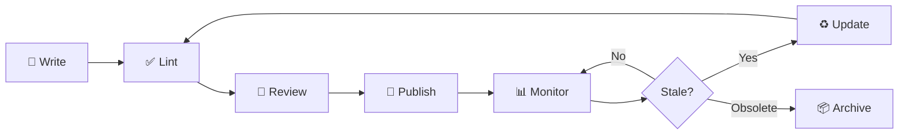

# Documentation Lifecycle Management Guide

> Quản lý vòng đời tài liệu từ **Write → Lint → Review → Publish → Audit → Archive**.
>
> Áp dụng cho mọi team/dự án sử dụng bộ Documentation Skills Toolkit.

---

## 📊 Docs-as-Code Philosophy

```text
Docs-as-Code = Docs sống cùng codebase, được quản lý như source code.

Code: Write → Lint → Review (PR) → Merge → Deploy → Monitor
Docs: Write → Lint → Review (PR) → Merge → Publish → Audit quarterly
```

### Tại sao Docs-as-Code?

| Vấn đề truyền thống                        | Docs-as-Code giải quyết             |
| ------------------------------------------ | ----------------------------------- |
| Docs nằm rải rác (Wiki, Drive, Confluence) | Tập trung trong Git repo, cùng code |
| Không biết ai sửa gì, khi nào              | Git history + blame + PR review     |
| Docs cũ không ai biết                      | Quarterly audit + freshness check   |
| Format không thống nhất                    | markdownlint enforce tự động        |
| Deploy thủ công                            | CI/CD auto-deploy on merge          |

---

## 🔄 Documentation Lifecycle



### Phase 1: Write

1. Chọn **skill phù hợp** từ Skill Map (xem `README.md`)
2. Copy **template** từ `templates/`
3. Điền nội dung theo **Iron Law** và **Guardrails** của skill
4. Thêm **YAML metadata header**:

```yaml
---
title: "Document Title"
description: "Mô tả ngắn gọn"
author: "Your Name"
created: 2026-03-26
updated: 2026-03-26
status: draft
tags: [operations, network]
---
```

### Phase 2: Lint

```bash
# Chạy markdownlint trước khi commit
npx markdownlint-cli2 "docs/**/*.md" --config .markdownlint.json

# Hoặc dùng pre-commit hook (setup 1 lần)
pip install pre-commit
cp config/pre-commit.yaml .pre-commit-config.yaml
pre-commit install
# Từ giờ git commit sẽ tự chạy lint
```

### Phase 3: Review

**Pull Request checklist** (copy vào PR template):

```markdown
## Doc Review Checklist
- [ ] markdownlint passed (CI green)
- [ ] mkdocs build passed (CI green)
- [ ] Technical accuracy verified by SME
- [ ] Non-author readability test passed
- [ ] Screenshots/diagrams up-to-date
- [ ] All links valid (internal + external)
- [ ] YAML metadata header present
- [ ] Status updated: `draft` → `review`
```

### Phase 4: Publish

```bash
# Option A: GitHub Pages (zero cost, zero ops)
mkdocs gh-deploy --force

# Option B: CI/CD auto-deploy (recommended)
# Copy examples/github-actions-docs.yml → .github/workflows/docs.yml
# Push to main → auto lint → build → deploy
```

### Phase 5: Monitor & Audit

**Quarterly Freshness Audit** (mỗi 3 tháng):

```bash
# Tìm docs không update > 90 ngày
find docs/ -name "*.md" -mtime +90 -type f | sort

# Tìm docs có status: draft (chưa approved)
grep -rl "status: draft" docs/ | sort
```

**Quarterly Audit Checklist:**

- [ ] Tất cả docs có `updated` date < 90 ngày?
- [ ] Contacts/escalation matrix up-to-date?
- [ ] IP addresses, hostnames, URLs chính xác?
- [ ] Screenshots match current UI?
- [ ] Không còn docs với `status: draft` quá 30 ngày?
- [ ] Broken links = 0?

### Phase 6: Archive

Docs không còn relevant → chuyển sang archive:

```bash
# Move to archive + update status
mv docs/operations/old-runbook.md docs/archive/
# Trong file: status: approved → status: archived
```

---

## 🏗 Setup Guide — Áp dụng cho dự án mới

### Step 1: Copy toolkit

```bash
# Clone hoặc copy bộ templates vào dự án
cp -r skills/ /new-project/docs-skills/

# Copy configs
cp examples/mkdocs-starter.yml /new-project/mkdocs.yml
cp config/.markdownlint.json /new-project/.markdownlint.json
cp config/pre-commit.yaml /new-project/.pre-commit-config.yaml
```

### Step 2: Install tools

```bash
# Python packages (MkDocs)
pip install mkdocs-material mkdocs-awesome-pages-plugin \
  mkdocs-git-revision-date-localized-plugin mkdocs-minify-plugin \
  mkdocs-glightbox

# Node package (Markdown lint)
npm install -g markdownlint-cli2

# Pre-commit hook
pip install pre-commit && pre-commit install
```

### Step 3: Setup CI/CD

```bash
# Copy GitHub Actions workflow
mkdir -p .github/workflows
cp examples/github-actions-docs.yml .github/workflows/docs.yml
```

### Step 4: Create docs structure

```bash
# Tạo folder structure chuẩn (theo docs-engineer.md §3.1)
mkdir -p docs/{getting-started,operations/{runbooks,server,network},training/{onboarding,advanced},development/{architecture,adr,api},guides/{how-to,reference},assets/{images,diagrams}}

# Tạo landing page
echo "# Project Documentation" > docs/index.md
```

> 💡 **Team infra/ops:** Xem `docs/infra-knowledge-base.md` để có starter structure sẵn cho network, Proxmox, Google Workspace, automation, GitHub, incidents.

### Step 5: Verify

```bash
# Build test
mkdocs build --strict

# Preview local
mkdocs serve
# → Mở http://localhost:8000
```

---

## 📈 Maturity Model

| Level  | Name        | Characteristics                       | Tools                        |
| ------ | ----------- | ------------------------------------- | ---------------------------- |
| **L1** | Ad-hoc      | Docs scattered (Wiki, Drive, email)   | None                         |
| **L2** | Centralized | Docs in Git, but no automation        | Git                          |
| **L3** | Automated   | markdownlint + CI/CD + pre-commit     | markdownlint, GitHub Actions |
| **L4** | Reviewed    | PR-based review + peer checklist      | PR templates, review policy  |
| **L5** | Optimized   | Quarterly audit + metrics + freshness | Audit scripts, monitoring    |

> **Target: L3-L4** cho hầu hết teams. L5 cho teams quản lý critical infrastructure.

---

## 🔑 Team Adoption Checklist

Trước khi share bộ toolkit cho team:

- [ ] toolkit/README.md dễ hiểu — team member mới đọc trong 5 phút
- [ ] Quick Start guide hoạt động — test từ đầu đến cuối
- [ ] `mkdocs serve` chạy thành công trên local
- [ ] CI pipeline hoạt động (PR → lint → build → deploy)
- [ ] Ít nhất 1 doc mẫu viết theo skill template
- [ ] Team đã demo/training 15 phút về cách dùng

---

> **Version:** 2.0.0 | **Cập nhật:** 2026-03-26
