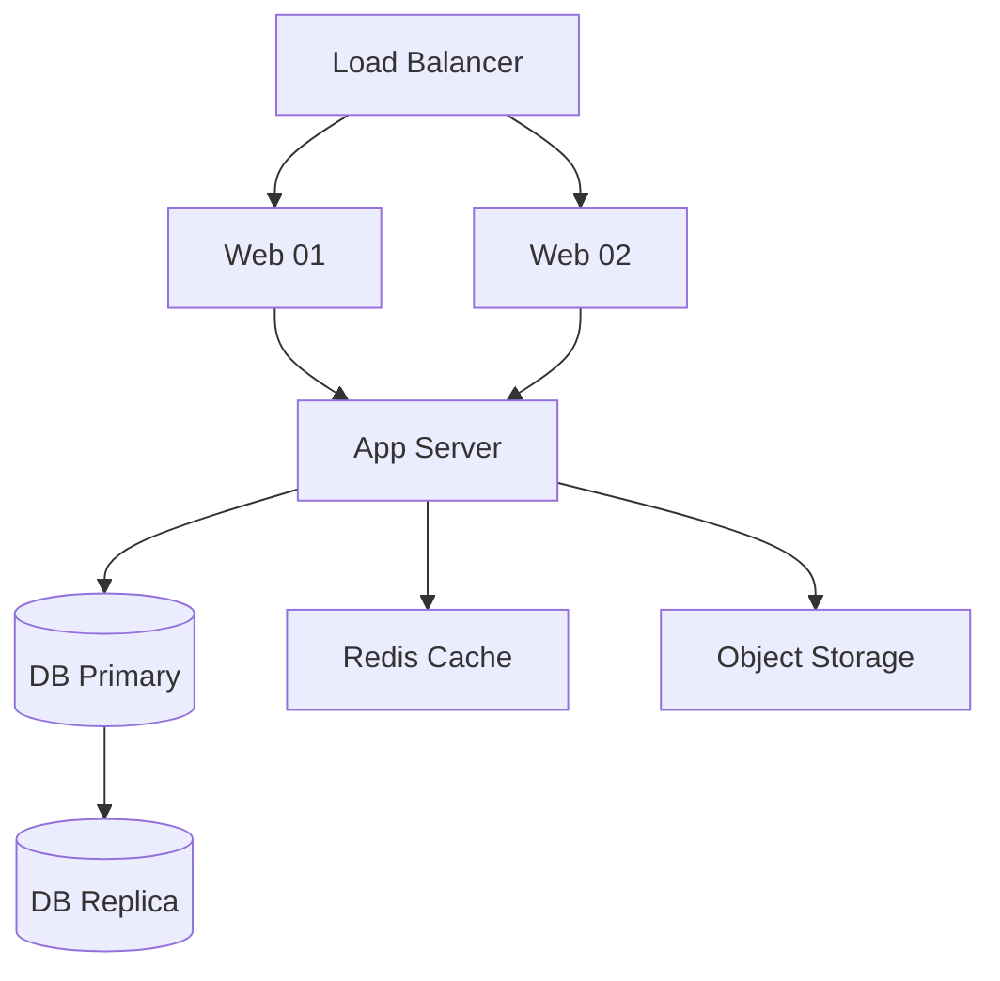
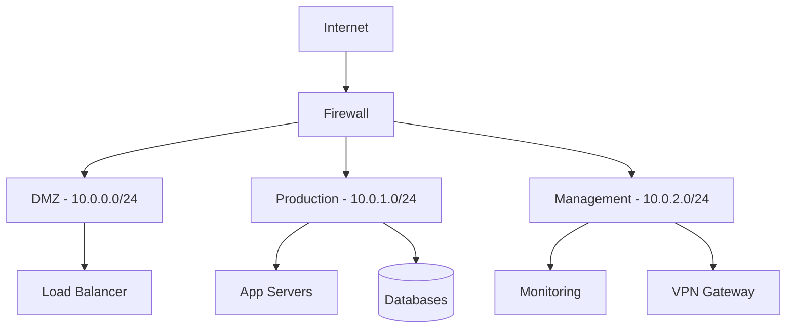

# Skill: Ops Runbook Writer

## Viết tài liệu vận hành & Runbook

**Agent:** 📝 [Documentation Agent]
**Source:** Adapted — [SkeltonThatcher/run-book-template](https://github.com/SkeltonThatcher/run-book-template), [awesome-runbook](https://github.com/runbear-io/awesome-runbook), [gitlab.com/tgdp/templates](https://gitlab.com/tgdp/templates)

---

## Context / Bối cảnh

| Key          | Value                                                                                    |
| ------------ | ---------------------------------------------------------------------------------------- |
| **Category** | ops / docs                                                                               |
| **Priority** | high                                                                                     |
| **Triggers** | Khi cần viết runbook, ops manual, network/server docs, incident docs                     |
| **Output**   | Runbook .md, operations manual .md, network topology docs, incident SOP                  |
| **Scope**    | IN: runbook, ops manual, server/network docs, incident. OUT: training, guides, code docs |

> Chuyên viết tài liệu vận hành hệ thống, runbook, quản lý server/network. Mọi runbook phải có commands chạy được + expected output.

---

## ⛔ THE IRON LAW

**Every runbook MUST have copy-paste commands AND expected output — prose-only = useless.**

---

## 🛡 Guardrails

- [ ] Mọi command trong runbook đã test và chạy được
- [ ] Contact info (escalation) up-to-date — verify trước khi publish
- [ ] Severity levels defined rõ ràng (P1/P2/P3/P4)
- [ ] Backup/rollback procedure đi kèm mọi thay đổi hệ thống

---

## 🎯 Khi nào dùng Skill này

```text
User request
  ├── Viết runbook / SOP vận hành?
  │     └── YES → Dùng skill này (Section 1)
  ├── Document network / server topology?
  │     └── YES → Dùng skill này (Section 3)
  ├── Viết operations manual?
  │     └── YES → Dùng skill này (Section 2)
  ├── Viết incident response docs?
  │     └── YES → Dùng skill này (Section 4)
  └── Viết training / guide?
        └── NO  → Xem training-guide-writer.md
```

| Dùng skill này khi...             | KHÔNG dùng khi...              |
| --------------------------------- | ------------------------------ |
| Viết runbook cho hệ thống cụ thể  | Viết user guide cho end-user   |
| Document server/network topology  | Viết training onboarding       |
| Tạo incident response playbook    | Viết API documentation         |
| Viết maintenance window procedure | Viết project development specs |

---

## 1. Runbook Structure

Adapted từ [SkeltonThatcher/run-book-template](https://github.com/SkeltonThatcher/run-book-template):

### 1.1 Runbook Template Sections

```markdown
# Runbook: [System/Service Name]

## Overview
- Purpose — hệ thống này làm gì
- Architecture diagram (Mermaid)
- Dependencies — upstream/downstream services
- SLA/SLO targets

## Health Checks
| Check         | Command                     | Expected Output   |
| ------------- | --------------------------- | ----------------- |
| Service alive | `curl -s localhost:8080/hz` | `{"status":"ok"}` |
| Disk usage    | `df -h /data`               | < 80%             |

## Common Tasks
### Start/Stop/Restart
| Action  | Command                        |
| ------- | ------------------------------ |
| Start   | `sudo systemctl start myapp`   |
| Stop    | `sudo systemctl stop myapp`    |
| Restart | `sudo systemctl restart myapp` |
| Status  | `sudo systemctl status myapp`  |

## Troubleshooting
### Issue: [Mô tả vấn đề]
**Symptoms:** [Dấu hiệu nhận biết]
**Root Cause:** [Nguyên nhân]
**Fix:**
1. Step 1 — `command here`
2. Step 2 — verify output
**Prevention:** [Rule ngăn lặp lại]

## Escalation
| Severity | Response Time | Contact        |
| -------- | ------------- | -------------- |
| P1       | 15 min        | On-call → Lead |
| P2       | 1 hour        | Team channel   |
| P3       | 4 hours       | Email          |
| P4       | Next sprint   | Backlog        |
```

### 1.2 Good / Bad Examples

```markdown
<!-- ✅ GOOD — có command + expected output + actual troubleshooting -->
### Check disk usage
```bash
df -h /data
# Expected: Use% < 80%
# If > 90%: run cleanup script
sudo /opt/scripts/cleanup-logs.sh --older-than 7d
```

<!-- ❌ BAD — chỉ có prose, không copy-paste được -->
### Check disk usage
Check the disk usage on the data partition. If it's too high,
clean up old logs. Contact the infrastructure team if needed.
```

---

## 2. Operations Manual

### 2.1 System Inventory Template

```markdown
## System Inventory

| System     | IP/Hostname | OS           | Role          | Owner |
| ---------- | ----------- | ------------ | ------------- | ----- |
| Web Server | 10.0.1.10   | Ubuntu 22.04 | Nginx reverse | Infra |
| App Server | 10.0.1.20   | Ubuntu 22.04 | Node.js app   | Dev   |
| DB Primary | 10.0.1.30   | Ubuntu 22.04 | PostgreSQL 15 | DBA   |
| DB Replica | 10.0.1.31   | Ubuntu 22.04 | PG Read-only  | DBA   |

## Dependency Map


## Daily Operations Checklist
- [ ] Health check — all services green
- [ ] Backup verification — last backup < 24h
- [ ] Log review — no critical errors
- [ ] Certificate expiry — > 30 days remaining
- [ ] Disk usage — < 80% on all servers
```

### 2.2 SLA Definitions

```markdown
| Metric              | Target   | Measurement                  |
| ------------------- | -------- | ---------------------------- |
| Uptime              | 99.9%    | Prometheus / UptimeRobot     |
| Response time (p95) | < 500ms  | APM tool (Datadog / Grafana) |
| Recovery time (RTO) | < 1 hour | Incident postmortem tracking |
| Data loss (RPO)     | < 1 hour | Backup schedule              |
```

---

## 3. Network & Server Documentation

### 3.1 Network Topology Template

```markdown
## Network Topology



## VLAN Layout
| VLAN ID | Name       | Subnet      | Purpose             |
| ------- | ---------- | ----------- | ------------------- |
| 10      | DMZ        | 10.0.0.0/24 | Public-facing       |
| 20      | Production | 10.0.1.0/24 | Application servers |
| 30      | Management | 10.0.2.0/24 | Admin access + VPN  |
| 40      | Database   | 10.0.3.0/24 | Database cluster    |

## Firewall Rules Summary
| #   | Source   | Dest      | Port | Protocol | Action | Note          |
| --- | -------- | --------- | ---- | -------- | ------ | ------------- |
| 1   | Internet | DMZ LB    | 443  | TCP      | ALLOW  | HTTPS only    |
| 2   | DMZ      | PROD App  | 8080 | TCP      | ALLOW  | Reverse proxy |
| 3   | PROD App | DB VLAN   | 5432 | TCP      | ALLOW  | PostgreSQL    |
| 4   | MGMT     | ALL VLANs | 22   | TCP      | ALLOW  | SSH admin     |
| 5   | ANY      | ANY       | ANY  | ANY      | DENY   | Default deny  |
```

### 3.2 Certificate & Backup Matrix

```markdown
## Certificate Management
| Domain          | Issuer        | Expiry     | Auto-renew | Owner |
| --------------- | ------------- | ---------- | ---------- | ----- |
| app.example.com | Let's Encrypt | 2026-06-15 | ✅ certbot  | Infra |
| api.example.com | DigiCert      | 2026-12-01 | ❌ manual   | Infra |

## Backup Strategy
| System   | Method   | Schedule  | Retention | Storage    | Test Restore |
| -------- | -------- | --------- | --------- | ---------- | ------------ |
| Database | pg_dump  | Every 6h  | 30 days   | S3 + local | Monthly      |
| Files    | rsync    | Daily 2AM | 14 days   | NAS        | Quarterly    |
| Config   | Git repo | On change | Forever   | GitHub     | On deploy    |
```

---

## 4. Incident & Maintenance Docs

### 4.1 Severity Matrix

| Level | Name     | Impact                  | Response    | Examples                     |
| ----- | -------- | ----------------------- | ----------- | ---------------------------- |
| P1    | Critical | Service down, data loss | 15 min      | DB crash, security breach    |
| P2    | Major    | Degraded performance    | 1 hour      | Slow queries, partial outage |
| P3    | Minor    | Workaround available    | 4 hours     | UI bug, non-critical error   |
| P4    | Low      | Cosmetic / enhancement  | Next sprint | Typo, minor UI adjustment    |

### 4.2 Maintenance Window Template

```markdown
## Maintenance Window: [Title]

| Field           | Value                            |
| --------------- | -------------------------------- |
| **Date/Time**   | YYYY-MM-DD HH:MM — HH:MM (UTC+7) |
| **Duration**    | X hours                          |
| **Impact**      | [Services affected]              |
| **Severity**    | [No downtime / Partial / Full]   |
| **Owner**       | [Team/Person]                    |
| **Approved by** | [Manager name]                   |

### Pre-checks
- [ ] Backup completed and verified
- [ ] Rollback plan documented and tested
- [ ] Stakeholders notified (24h advance)
- [ ] Monitoring dashboard ready

### Steps
1. [Step description] — `command`
2. [Verify step] — expected output: `...`

### Post-checks
- [ ] Service health: all green
- [ ] No error spike in monitoring
- [ ] Performance within SLA thresholds
- [ ] Stakeholders notified: maintenance complete
```

> 📖 **Template library đầy đủ** → [doc-templates-library.md](references/doc-templates-library.md)

---

## ✅ Pre-delivery Checklist — Runbook/Ops Docs

Trước khi báo "done", verify:

- [ ] Mọi command trong doc đã test — copy-paste chạy được
- [ ] Expected output ghi rõ — người đọc biết kết quả đúng/sai
- [ ] Contact info / escalation matrix up-to-date
- [ ] Diagrams (Mermaid) render đúng trong MkDocs
- [ ] IP addresses, hostnames, ports chính xác

---

## 📓 Error Journal — Never Repeat Failures

| Date     | Error                           | Root Cause         | Prevention Rule             |
| -------- | ------------------------------- | ------------------ | --------------------------- |
| template | Stale IP in runbook → wrong SSH | Server migration   | Cross-ref inventory monthly |
| template | Expired contact in escalation   | Team restructure   | Quarterly contact review    |
| template | Command fails silently          | Missing `set -euo` | All bash blocks: `set -euo` |

> **Rule:** Mỗi lần fix doc error trong ops domain → thêm 1 row.

---

## 🚩 Red Flags — STOP

| Action                          | Problem                                         |
| ------------------------------- | ----------------------------------------------- |
| Runbook chỉ có text mô tả       | → PHẢI có copy-paste commands + expected output |
| Missing escalation contacts     | → Mọi runbook PHẢI có escalation matrix         |
| Untested commands in runbook    | → Test commands trên staging TRƯỚC khi publish  |
| Hardcode credentials in docs    | → Dùng `$ENV_VAR` placeholder, NEVER plaintext  |
| Missing rollback in maintenance | → Mọi maintenance window PHẢI có rollback plan  |

---

## Remember

| Rule                 | Description                                       |
| -------------------- | ------------------------------------------------- |
| **Commands first**   | Copy-paste commands > prose descriptions          |
| **Expected output**  | Luôn ghi rõ output đúng — người đọc tự verify     |
| **Test before ship** | Test mọi command trên staging trước khi publish   |
| **Quarterly review** | Review contacts, IPs, procedures mỗi quý          |
| **Mermaid diagrams** | Network topology, dependency map = Mermaid        |
| **No secrets**       | NEVER hardcode passwords, tokens, keys trong docs |

## 🔗 Related Skills

| Khi cần...                       | Xem skill                              |
| -------------------------------- | -------------------------------------- |
| Setup MkDocs, markdown standards | `docs-engineer.md`                     |
| Viết training/guide docs         | `training-guide-writer.md`             |
| Copy-paste doc templates         | `references/doc-templates-library.md`  |
| MkDocs plugins recommendation    | `references/mkdocs-plugins-catalog.md` |

<!-- Used: 2026-03-26 -->
