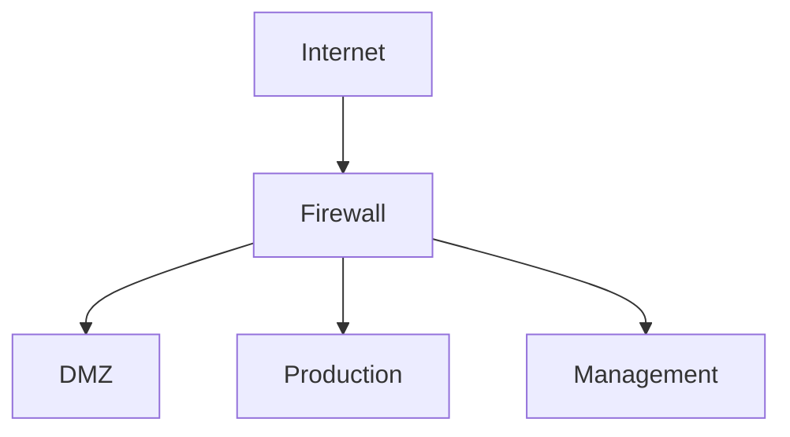

# Document Templates Library

> Starter templates cho mỗi loại tài liệu. Copy → customize → deploy.
>
> Sources: [SkeltonThatcher/run-book-template](https://github.com/SkeltonThatcher/run-book-template), [Google Style Guide](https://developers.google.com/style), [gitlab.com/tgdp/templates](https://gitlab.com/tgdp/templates)

---

## Template Index

| #   | Template                    | Use Case                    | Related Skill            |
| --- | --------------------------- | --------------------------- | ------------------------ |
| T1  | Runbook                     | System operation procedures | ops-runbook-writer.md    |
| T2  | ADR (Architecture Decision) | Design decisions log        | project-doc-writer.md    |
| T3  | How-to Guide                | Step-by-step instructions   | project-doc-writer.md    |
| T4  | Training Module             | Internal training           | training-doc-writer.md   |
| T5  | Network Topology            | Network documentation       | ops-runbook-writer.md    |
| T6  | Incident Postmortem         | Post-incident learning      | ops-runbook-writer.md    |
| T7  | Maintenance Window          | Planned change request      | ops-runbook-writer.md    |
| T8  | Release Notes               | Version release summary     | project-doc-writer.md    |

---

## T1: Runbook Template

```markdown
# Runbook: [System/Service Name]

> Last verified: YYYY-MM-DD | Owner: [Team]

## Overview

| Field           | Value                    |
| --------------- | ------------------------ |
| **Service**     | [tên service]            |
| **Environment** | production / staging     |
| **URL**         | [endpoint URL]           |
| **Repository**  | [git repo link]          |
| **On-call**     | [rotation schedule link] |

## Architecture
<!-- Mermaid diagram: service dependencies -->

## Health Checks
| Check        | Command                | Expected | Alert If    |
| ------------ | ---------------------- | -------- | ----------- |
| [check name] | `[copy-paste command]` | [output] | [condition] |

## Start / Stop / Restart
| Action  | Command     | Verify With        |
| ------- | ----------- | ------------------ |
| Start   | `[command]` | `[verify command]` |
| Stop    | `[command]` | `[verify command]` |
| Restart | `[command]` | `[verify command]` |

## Troubleshooting
### [Issue Title]
**Symptoms:** [what you see]
**Root Cause:** [why it happens]
**Fix:**
1. `[command]` — [explain]
2. `[command]` — verify: [expected output]
**Prevention:** [how to prevent recurrence]

## Escalation
| Severity | Response | Contact         | Channel          |
| -------- | -------- | --------------- | ---------------- |
| P1       | 15 min   | [name/rotation] | [phone/Slack/PD] |
| P2       | 1 hour   | [name/team]     | [Slack channel]  |
| P3       | 4 hours  | [team]          | [email/ticket]   |
```

---

## T2: ADR Template

```markdown
# ADR-[NNN]: [Decision Title]

| Field         | Value                                                    |
| ------------- | -------------------------------------------------------- |
| **Status**    | Proposed / Accepted / Deprecated / Superseded by ADR-XXX |
| **Date**      | YYYY-MM-DD                                               |
| **Author**    | [Name]                                                   |
| **Reviewers** | [Names]                                                  |

## Context
[What is the issue or opportunity that motivates this decision?]

## Decision
[What is the change that we're proposing and/or doing?]

## Alternatives Considered
| Option         | Pros       | Cons        |
| -------------- | ---------- | ----------- |
| Option A       | [benefits] | [drawbacks] |
| **Option B** ✅ | [benefits] | [drawbacks] |

## Consequences
- **Positive:** [benefits we gain]
- **Negative:** [trade-offs we accept]
- **Risks:** [things to monitor]
```

---

## T3: How-to Guide Template

```markdown
# How to [Action Verb + Object]

> **Audience:** [role/skill level] | **Time:** ~X min | **Difficulty:** ⭐/⭐⭐/⭐⭐⭐

## Prerequisites
- [ ] [thing needed 1]
- [ ] [thing needed 2]

## Steps

### Step 1: [Action verb + object]
[Brief explanation of why this step is needed]

```bash
[copy-paste command]
```

**Expected result:**
```
[what you should see]
```

### Step 2: [Action verb + object]
[...]

## Verify
- [ ] [How to confirm success]

## Troubleshooting
<details>
<summary>Error: [common error message]</summary>

**Cause:** [why it happens]
**Fix:** [how to resolve]
</details>

## Next Steps
- [Related guide](link)
```

---

## T4: Training Module Template

```markdown
# Training: [Module Name]

| Field             | Value                       |
| ----------------- | --------------------------- |
| **Audience**      | [role] — [level]            |
| **Duration**      | [time estimate]             |
| **Prerequisites** | [prior knowledge/tools]     |
| **Objectives**    | [what learner will achieve] |

## Lesson 1: [Topic]

### Concepts
- **[Concept 1]:** [explanation]
- **[Concept 2]:** [explanation]

### Hands-on Lab
1. [Step] — `[command/action]`
   Expected: `[output]`
2. [Step] — `[command/action]`
   Expected: `[output]`

### Knowledge Check
- [ ] Can learner explain [concept]?
- [ ] Did learner complete lab successfully?

## Assessment
| Criteria        | Pass Condition  |
| --------------- | --------------- |
| Lab completion  | 100% steps done |
| Knowledge check | ≥ 80% correct   |
```

---

## T5: Network Topology Template

```markdown
# Network Documentation: [Environment Name]

## Topology Diagram


## VLAN Layout
| VLAN ID | Name   | Subnet       | Purpose | Gateway   |
| ------- | ------ | ------------ | ------- | --------- |
| [id]    | [name] | [x.x.x.x/xx] | [desc]  | [x.x.x.x] |

## Server Inventory
| Hostname   | IP   | OS           | Role   | VLAN | Owner  |
| ---------- | ---- | ------------ | ------ | ---- | ------ |
| [hostname] | [ip] | [os version] | [role] | [id] | [team] |

## Firewall Rules
| #   | Source   | Dest   | Port   | Proto | Action | Note   |
| --- | -------- | ------ | ------ | ----- | ------ | ------ |
| 1   | [source] | [dest] | [port] | TCP   | ALLOW  | [note] |

## Certificate Register
| Domain   | Issuer   | Expiry     | Auto-renew | Owner |
| -------- | -------- | ---------- | ---------- | ----- |
| [domain] | [issuer] | YYYY-MM-DD | ✅/❌        | [who] |

## DNS Records (Critical)
| Record   | Type | Value | TTL |
| -------- | ---- | ----- | --- |
| [domain] | A    | [ip]  | 300 |
```

---

## T6: Incident Postmortem Template

```markdown
# Postmortem: [Incident Title]

| Field        | Value             |
| ------------ | ----------------- |
| **Severity** | P1 / P2 / P3      |
| **Date**     | YYYY-MM-DD        |
| **Duration** | HH:MM start → end |
| **Impact**   | [users/services]  |
| **Owner**    | [incident lead]   |
| **Status**   | Draft / Reviewed  |

## Summary
[1-2 sentences: what happened and impact]

## Timeline
| Time (UTC+7) | Event              | Actor |
| ------------ | ------------------ | ----- |
| HH:MM        | [first detection]  | [who] |
| HH:MM        | [escalation]       | [who] |
| HH:MM        | [fix applied]      | [who] |
| HH:MM        | [service restored] | [who] |

## Root Cause
[Detailed analysis of why it happened]

## What Went Wrong
- [thing 1]
- [thing 2]

## What Went Right
- [thing 1]
- [thing 2]

## Action Items
| #   | Action                  | Owner  | Due Date   | Status |
| --- | ----------------------- | ------ | ---------- | ------ |
| 1   | [fix/prevention action] | [name] | YYYY-MM-DD | Open   |

## Lessons Learned
- [lesson 1]
- [lesson 2]
```

---

## T7: Maintenance Window Template

```markdown
# Maintenance: [Title]

| Field           | Value                            |
| --------------- | -------------------------------- |
| **Schedule**    | YYYY-MM-DD HH:MM — HH:MM (UTC+7) |
| **Duration**    | [X hours]                        |
| **Impact**      | [services affected]              |
| **Downtime**    | None / Partial / Full            |
| **Owner**       | [team/person]                    |
| **Approved by** | [approver]                       |

## Pre-checks
- [ ] Backup completed and verified
- [ ] Rollback plan ready and tested
- [ ] Stakeholders notified (≥24h advance)
- [ ] Monitoring dashboard open

## Procedure
| #   | Step          | Command     | Verify            |
| --- | ------------- | ----------- | ----------------- |
| 1   | [description] | `[command]` | [expected output] |
| 2   | [description] | `[command]` | [expected output] |

## Rollback
| #   | Step            | Command     |
| --- | --------------- | ----------- |
| 1   | [rollback step] | `[command]` |

## Post-checks
- [ ] All services healthy
- [ ] No error spike in monitoring (15 min observation)
- [ ] Performance within SLA
- [ ] Stakeholders notified: complete
```

---

## T8: Release Notes Template

```markdown
# Release Notes — v[X.Y.Z]

**Date:** YYYY-MM-DD | **Author:** [name]

## Highlights
- 🆕 [Major new feature]
- 🐛 [Important bug fix]
- ⚡ [Performance improvement]

## New Features
| Feature        | Description         | Docs Link       |
| -------------- | ------------------- | --------------- |
| [feature name] | [brief description] | [link to guide] |

## Bug Fixes
| Issue             | Fix                | Affected Area |
| ----------------- | ------------------ | ------------- |
| [bug description] | [how it was fixed] | [component]   |

## Breaking Changes
> ⚠️ [If any — describe migration steps]

## Known Issues
| Issue   | Workaround   | ETA Fix        |
| ------- | ------------ | -------------- |
| [issue] | [workaround] | [version/date] |

## Upgrade Instructions
1. [Step 1]
2. [Step 2]
```
