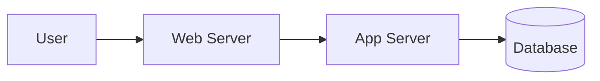

# Skill: Docs Engineer

## Quản lý nền tảng MkDocs & Tiêu chuẩn Markdown

**Agent:** 📝 [Documentation Agent]
**Source:** Adapted — [mkdocs-material](https://github.com/squidfunk/mkdocs-material), [markdownlint](https://github.com/DavidAnson/markdownlint), [Google Developer Style Guide](https://developers.google.com/style)

---

## Context / Bối cảnh

| Key          | Value                                                                              |
| ------------ | ---------------------------------------------------------------------------------- |
| **Category** | docs                                                                               |
| **Priority** | core                                                                               |
| **Triggers** | Khi khởi tạo docs project, setup MkDocs, hoặc review docs                          |
| **Output**   | mkdocs.yml config, .markdownlint.json, cấu trúc docs/                              |
| **Scope**        | IN: MkDocs setup, markdown standards, doc structure. OUT: nội dung domain-specific |
| **Version**      | 1.0.0                                                                              |
| **Last Updated** | 2026-03-26                                                                         |

> Foundation skill cho mọi documentation project. Setup MkDocs platform, enforce markdown standards, chuẩn hóa cấu trúc thư mục.

---

## ⛔ THE IRON LAW

**Every document MUST pass markdownlint AND render correctly in MkDocs — NO exceptions.**

---

## 🛡 Guardrails

- [ ] `mkdocs.yml` valid YAML — `mkdocs build` pass trước khi commit
- [ ] `markdownlint` 0 errors trên tất cả `.md` files
- [ ] Navigation structure trong `mkdocs.yml` khớp với folder thực tế
- [ ] Mermaid diagrams render đúng trong MkDocs (test local)
- [ ] UI standards: admonitions cho metadata/warnings, task lists cho checklists, code blocks cho long commands

---

## 🎯 Khi nào dùng Skill này

```text
User request
  ├── Khởi tạo documentation project mới?
  │     ├── YES → Dùng skill này (Section 1: Setup)
  │     └── NO
  │           ├── Review/fix markdown quality?
  │           │     ├── YES → Dùng skill này (Section 2: Style Guide)
  │           │     └── NO  → Xem ops-runbook-writer.md hoặc training-doc-writer.md / project-doc-writer.md
  │           └── Thêm component (admonition, tabs, diagram)?
  │                 └── YES → Dùng skill này (Section 3: Components)
```

| Dùng skill này khi...         | KHÔNG dùng khi...              |
| ----------------------------- | ------------------------------ |
| Setup MkDocs project từ đầu   | Viết nội dung runbook cụ thể   |
| Chuẩn hóa markdown format     | Viết training material         |
| Chọn plugins cho MkDocs       | Thiết kế network topology docs |
| Review doc structure & naming | Tạo slide presentation         |

---

## 1. MkDocs Project Setup

### 1.1 Cài đặt & khởi tạo

```bash
# Install
pip install mkdocs-material mkdocs-awesome-pages-plugin \
  mkdocs-git-revision-date-localized-plugin mkdocs-minify-plugin \
  mkdocs-print-site-plugin

# Init
mkdocs new my-docs && cd my-docs
```

### 1.2 mkdocs.yml chuẩn

```yaml
site_name: "Project Documentation"
theme:
  name: material
  language: vi
  palette:
    - scheme: default
      primary: indigo
      toggle: { icon: material/brightness-7, name: Dark mode }
    - scheme: slate
      primary: indigo
      toggle: { icon: material/brightness-4, name: Light mode }
  features:
    - navigation.tabs
    - navigation.sections
    - navigation.expand
    - navigation.top
    - search.highlight
    - content.code.copy
    - content.tabs.link

plugins:
  - search
  - awesome-pages
  - git-revision-date-localized: { enable_creation_date: true }
  - minify: { minify_html: true }
markdown_extensions:
  - admonition
  - pymdownx.details
  - pymdownx.superfences: { custom_fences: [{ name: mermaid, class: mermaid, format: !!python/name:pymdownx.superfences.fence_code_format }] }
  - pymdownx.tabbed: { alternate_style: true }
  - pymdownx.highlight: { anchor_linenums: true }
  - pymdownx.inlinehilite
  - pymdownx.keys
  - attr_list
  - md_in_html
  - tables
  - toc: { permalink: true }
```

> 📖 **Plugin catalog đầy đủ** → [mkdocs-plugins-catalog.md](../docs/mkdocs-plugins-catalog.md)

---

## 2. Markdown Style Guide

### 2.1 Heading Rules

```markdown
<!-- ✅ GOOD — heading hierarchy tăng dần -->
# Document Title (H1 — chỉ 1 lần)
## Major Section (H2)
### Sub-section (H3)

<!-- ❌ BAD — skip heading level -->
# Title
### Sub-section (skip H2!)
```

### 2.2 Essential markdownlint Rules

| Rule  | Name                   | Lưu ý                                |
| ----- | ---------------------- | ------------------------------------ |
| MD001 | heading-increment      | Heading chỉ tăng 1 level mỗi lần     |
| MD009 | no-trailing-spaces     | Xóa spaces thừa cuối dòng            |
| MD012 | no-multiple-blanks     | Max 1 blank line liên tiếp           |
| MD022 | blanks-around-headings | Heading phải có blank line trên/dưới |
| MD031 | blanks-around-fences   | Code block phải có blank line        |
| MD032 | blanks-around-lists    | List phải có blank line trước/sau    |
| MD040 | fenced-code-language   | Code block PHẢI specify language     |

### 2.3 Writing Tone (Google Style)

- **Active voice** > passive voice: "Click Save" not "Save should be clicked"
- **Present tense** > future: "This command installs" not "will install"
- **Second person** "you" > third person: "You can configure" not "Users can configure"
- **Short sentences** — max 25 words per sentence
- **One idea per paragraph** — break long paragraphs

---

## 3. Document Structure Standards

### 3.1 Folder Taxonomy

```text
docs/
├── index.md                    # Landing page
├── getting-started/            # Onboarding
│   ├── installation.md
│   ├── quick-start.md
│   └── prerequisites.md
├── operations/                 # Vận hành
│   ├── runbooks/
│   ├── network/
│   └── server/
├── training/                   # Training nội bộ
│   ├── onboarding/
│   └── advanced/
├── development/                # Phát triển dự án
│   ├── architecture/
│   ├── adr/                    # Architecture Decision Records
│   └── api/
├── guides/                     # Hướng dẫn
│   ├── how-to/
│   └── reference/
└── assets/                     # Images, diagrams
    ├── images/
    └── diagrams/
```

### 3.2 File Naming

- **kebab-case** lowercase: `network-topology.md` ✅ not `Network_Topology.md` ❌
- **Prefix số** khi cần thứ tự: `01-installation.md`, `02-configuration.md`
- **Suffix `-guide`** cho hướng dẫn: `admin-guide.md`, `backup-guide.md`

### 3.3 Document Header

```markdown
---
title: "Document Title"
description: "Mô tả ngắn 1-2 câu"
author: "Team/Person"
created: 2026-03-26
updated: 2026-03-26
status: draft | review | approved | archived
tags: [operations, network, server]
---
```

---

## 4. MkDocs-Material Components

### 4.1 Admonitions

```markdown
!!! note "Ghi chú"
    Thông tin bổ sung.

!!! warning "Cảnh báo"
    Hành động có thể gây ảnh hưởng.

!!! danger "Nguy hiểm"
    KHÔNG thực hiện nếu chưa backup.

??? tip "Mẹo (collapsible)"
    Click để mở rộng.
```

### 4.2 Content Tabs

```markdown
=== "Linux"
    ```bash
    sudo apt install nginx
    ```

=== "macOS"
    ```bash
    brew install nginx
    ```
```

### 4.3 Mermaid Diagrams

````markdown

````

---

## ✅ Pre-delivery Checklist — MkDocs Project

Trước khi báo "done", verify:

- [ ] `mkdocs build` pass — 0 warnings
- [ ] `markdownlint` pass — 0 errors trên tất cả `.md`
- [ ] Navigation hiển thị đúng trên `mkdocs serve`
- [ ] Mermaid diagrams render — không bị raw text
- [ ] Mobile responsive — test viewport 375px

---

## 🚩 Red Flags — STOP

| Action                          | Problem                                             |
| ------------------------------- | --------------------------------------------------- |
| Dùng raw HTML thay cho Markdown | → MkDocs component (admonitions, tabs) luôn tốt hơn |
| Skip heading levels (H1→H3)     | → Phá vỡ navigation & accessibility                 |
| Hardcode paths trong docs       | → Dùng relative links, MkDocs resolve tự động       |
| File name có spaces/uppercase   | → kebab-case bắt buộc                               |
| Commit without `mkdocs build`   | → Broken build = broken docs site                   |

---

## Remember

| Rule                   | Description                                      |
| ---------------------- | ------------------------------------------------ |
| **markdownlint first** | Chạy lint TRƯỚC khi commit bất kỳ `.md` nào      |
| **Material theme**     | Luôn dùng mkdocs-material — feature-rich nhất    |
| **Folder = nav**       | Cấu trúc folder quyết định navigation            |
| **YAML header**        | Mọi doc có metadata: title, status, updated      |
| **Active voice**       | "Click Save" không phải "Save should be clicked" |

## 🔗 Related Skills

| Khi cần...                | Xem skill                              |
| ------------------------- | -------------------------------------- |
| Viết runbook/ops docs         | `ops-runbook-writer.md`  |
| Viết training/onboarding      | `training-doc-writer.md` |
| Viết ADR, guide, tech spec    | `project-doc-writer.md`  |
| Viết security/compliance docs | `infra-security-doc.md`  |

> **See also:** [Plugin Catalog](../docs/mkdocs-plugins-catalog.md) · [Templates](../templates/)

<!-- Used: 2026-03-27 -->
