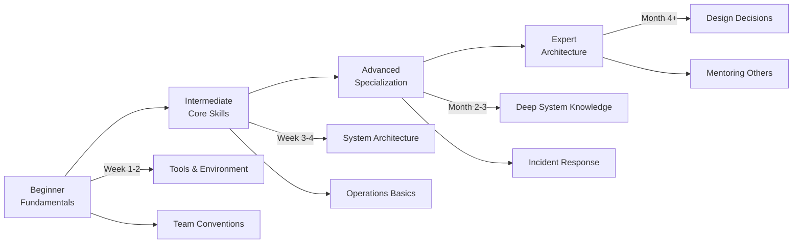

# Skill: Training Doc Writer

## Viết tài liệu Training & Onboarding

**Agent:** 📝 [Documentation Agent]
**Source:** Adapted — [Google Developer Style Guide](https://developers.google.com/style), [gitlab.com/tgdp/templates](https://gitlab.com/tgdp/templates), [mkdocs-material](https://squidfunk.github.io/mkdocs-material/)

---

## Context / Bối cảnh

| Key          | Value                                                                                            |
| ------------ | ------------------------------------------------------------------------------------------------ |
| **Category** | docs                                                                                             |
| **Priority** | high                                                                                             |
| **Triggers** | Khi cần viết training docs, onboarding material, learning path, doc review process               |
| **Output**   | Training material .md, onboarding checklist .md, learning path diagram                           |
| **Scope**        | IN: training, onboarding, curriculum, hands-on labs, doc review. OUT: ADR, tech spec, runbook |
| **Version**      | 1.0.0                                                                                            |
| **Last Updated** | 2026-03-27                                                                                       |

> Chuyên viết tài liệu training nội bộ và onboarding. Mọi training phải có hands-on lab, mọi guide phải có Prerequisites → Steps → Expected Result.

---

## ⛔ THE IRON LAW

**Every training doc MUST have Prerequisites → Steps → Expected Result → Troubleshooting — skip any = incomplete.**

---

## 🛡 Guardrails

- [ ] Target audience được xác định rõ (beginner / intermediate / advanced)
- [ ] Prerequisites listed — reader biết cần gì trước khi bắt đầu
- [ ] Screenshots/diagrams up-to-date — match current UI/system
- [ ] Tested by non-author — ít nhất 1 người khác đọc hiểu được

---

## 🎯 Khi nào dùng Skill này

```text
User request
  ├── Viết training / onboarding docs?
  │     └── YES → Dùng skill này (Section 1)
  ├── Thiết kế learning path / curriculum?
  │     └── YES → Dùng skill này (Section 1.3)
  ├── Cần doc review process / versioning?
  │     └── YES → Dùng skill này (Section 2)
  ├── Viết ADR / tech spec / how-to guide?
  │     └── NO  → Xem project-doc-writer.md
  └── Viết runbook / ops docs?
        └── NO  → Xem ops-runbook-writer.md
```

| Dùng skill này khi...         | KHÔNG dùng khi...              |
| ----------------------------- | ------------------------------ |
| Viết training material mới    | Viết ADR / tech spec           |
| Tạo onboarding docs cho team  | Viết how-to guide              |
| Thiết kế learning path        | Viết runbook vận hành          |
| Tạo hands-on lab exercises    | Document network topology      |

---

## 1. Training Material

### 1.1 Training Document Template

```markdown
# Training: [Module Name]

| Field                   | Value                               |
| ----------------------- | ----------------------------------- |
| **Audience**            | [Junior/Mid/Senior] + [Role]        |
| **Duration**            | [Estimated time]                    |
| **Prerequisites**       | [Skills/tools cần có]               |
| **Learning Objectives** | [Sau khi hoàn thành, learner sẽ...] |

## Module Content

### Lesson 1: [Topic]

**Concepts:**
- Key concept 1 — giải thích ngắn gọn
- Key concept 2 — kèm ví dụ

**Hands-on Lab:**
1. Step 1 — `command hoặc action`
   - Expected result: `output mong đợi`
2. Step 2 — tiếp tục...

**Knowledge Check:**
- [ ] Learner có thể giải thích concept 1?
- [ ] Learner hoàn thành lab thành công?

### Lesson 2: [Topic]
[...]

## Assessment
| Criteria        | Pass Condition        |
| --------------- | --------------------- |
| Lab completion  | 100% steps pass       |
| Knowledge check | ≥ 80% correct         |
| Practical demo  | Can perform task solo |
```

### 1.2 Onboarding Checklist Template

```markdown
## Onboarding: [Role Name]

### Week 1 — Foundation
- [ ] Account setup: email, Slack, VPN, Git
- [ ] Read: Architecture overview → `docs/development/architecture/`
- [ ] Read: Team conventions → `docs/guides/conventions.md`
- [ ] Lab: Setup local development environment
- [ ] Meet: 1-on-1 with team lead

### Week 2 — Deep Dive
- [ ] Read: System operations → `docs/operations/runbooks/`
- [ ] Lab: Deploy to staging (with mentor)
- [ ] Lab: Debug a sample issue (guided)
- [ ] Read: Security policies → `docs/guides/security.md`

### Week 3 — Autonomy
- [ ] Task: Fix a real P4 bug independently
- [ ] Task: Write 1 runbook entry (reviewed)
- [ ] Present: Quick demo of work to team
- [ ] Feedback: 1-on-1 review with mentor
```

### 1.3 Learning Path Design



### 1.4 Knowledge Validation Patterns

Three validation patterns for training documents:

**Pattern 1: Q&A Collapsible (MkDocs compatible)**

```markdown
??? question "Câu hỏi: [question text]"
    **Đáp án:** [answer]
    **Giải thích:** [why this is correct]
```

**Pattern 2: Scenario-based Assessment**

```markdown
## Scenario: [situation description]
Given: [context]
When: [action/trigger]
Expected: [what learner should do/answer]
```

**Pattern 3: Competency Matrix**

```markdown
| Skill | Beginner | Intermediate | Advanced |
|-------|----------|-------------|----------|
| [skill] | Can explain concept | Can apply in practice | Can teach others |
```

> 📖 **Assessment guide đầy đủ** → [training-assessment-guide.md](../docs/training-assessment-guide.md)

---

## 2. Doc Review Process

### 2.1 Peer Review Checklist

Trước khi merge doc vào main branch:

- [ ] **Accuracy:** Technical content verified by SME
- [ ] **Clarity:** Đọc hiểu được bởi target audience (non-expert test)
- [ ] **Completeness:** Prerequisites + Steps + Expected Result + Troubleshooting
- [ ] **Format:** markdownlint pass, heading hierarchy correct
- [ ] **Freshness:** Screenshots/diagrams match current UI
- [ ] **Links:** Tất cả internal/external links hoạt động

### 2.2 Versioning Strategy

```markdown
<!-- Trong YAML header của mỗi doc -->
---
version: "1.2"
status: approved         # draft → review → approved → archived
changelog:
  - "1.2 (2026-03-26): Updated Step 3 for new UI"
  - "1.1 (2026-03-15): Added troubleshooting section"
  - "1.0 (2026-03-01): Initial release"
---
```

> 📖 **Template library đầy đủ** → [doc-templates-library.md](../templates/)

---

## ✅ Pre-delivery Checklist — Training Docs

Trước khi báo "done", verify:

- [ ] Target audience specified — beginner/intermediate/advanced
- [ ] Prerequisites listed — reader biết cần gì
- [ ] Mọi step có expected result — reader verify được
- [ ] Screenshots match current UI — không outdated
- [ ] Tested by non-author — ít nhất 1 người đọc hiểu
- [ ] Tất cả links valid — internal + external

---

## 🚩 Red Flags — STOP

| Action                             | Problem                                             |
| ---------------------------------- | --------------------------------------------------- |
| Guide không có expected result     | → Reader không biết đúng/sai → hỏi lại = waste time |
| Missing target audience definition | → Quá đơn giản hoặc quá phức tạp cho reader         |
| Copy-paste từ guide cũ             | → Verify content match current version              |
| Screenshots từ 3+ months ago       | → Re-capture nếu UI đã thay đổi                     |
| Training without hands-on lab      | → Lý thuyết alone = low retention                   |

---

## Remember

| Rule                 | Description                                            |
| -------------------- | ------------------------------------------------------ |
| **4-part structure** | Prerequisites → Steps → Expected Result → Troubleshoot |
| **Audience first**   | Define audience TRƯỚC khi viết bất kỳ content nào      |
| **Hands-on labs**    | Training PHẢI có lab — theory alone = 10% retention    |
| **Active voice**     | "Click Save" not "Save should be clicked"              |
| **Non-author test**  | Ít nhất 1 người khác đọc hiểu trước khi publish        |
| **Version control**  | YAML header: version, status, changelog                |

## 🔗 Related Skills

| Khi cần...                       | Xem skill                              |
| -------------------------------- | -------------------------------------- |
| Viết ADR, tech spec, how-to      | `project-doc-writer.md`  |
| Setup MkDocs, markdown standards | `docs-engineer.md`       |
| Viết runbook / ops docs          | `ops-runbook-writer.md`  |
| Viết security/compliance docs   | `infra-security-doc.md`  |

> **See also:** [Assessment Guide](../docs/training-assessment-guide.md) · [Templates](../templates/)

<!-- Used: 2026-03-27 -->
