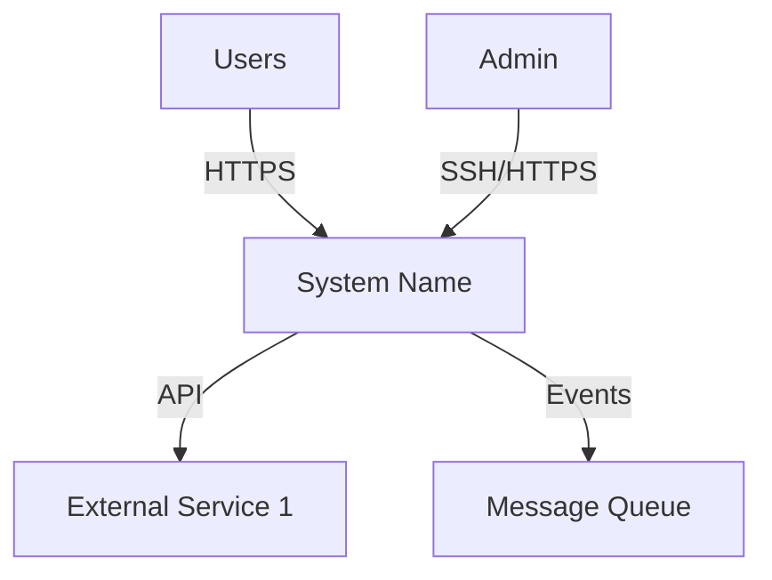
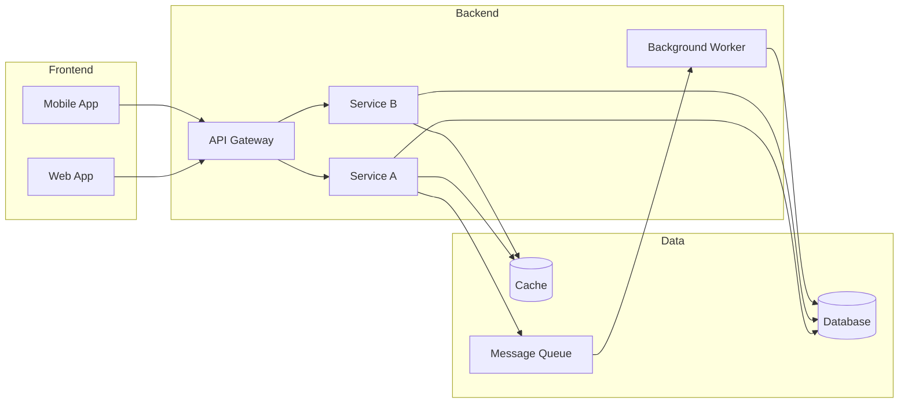
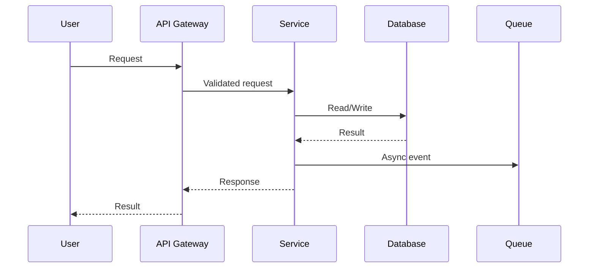
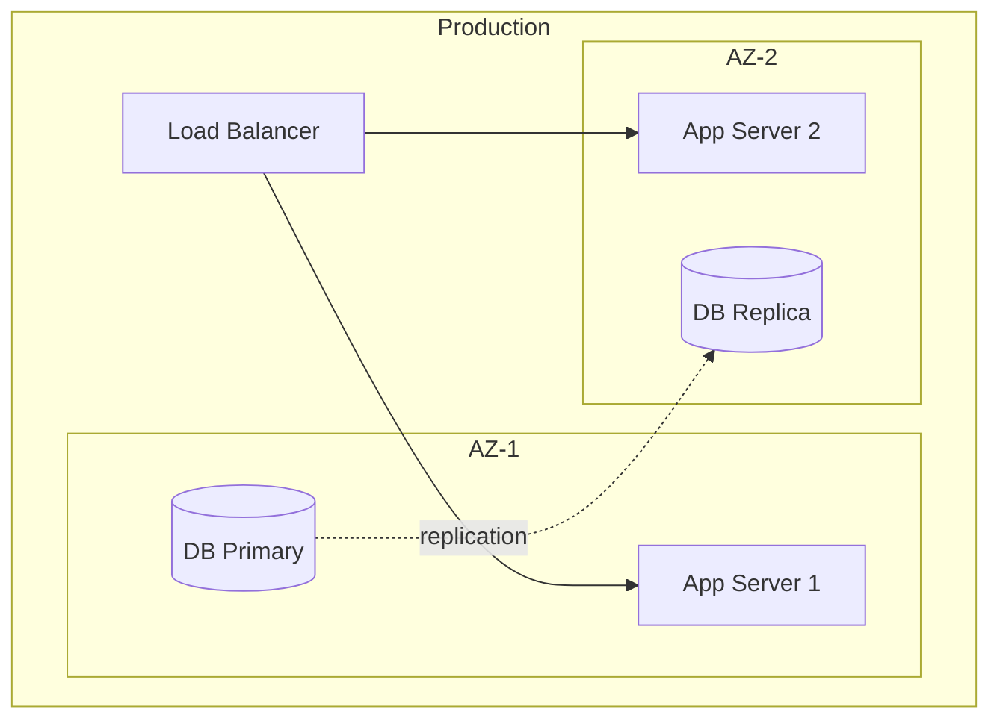
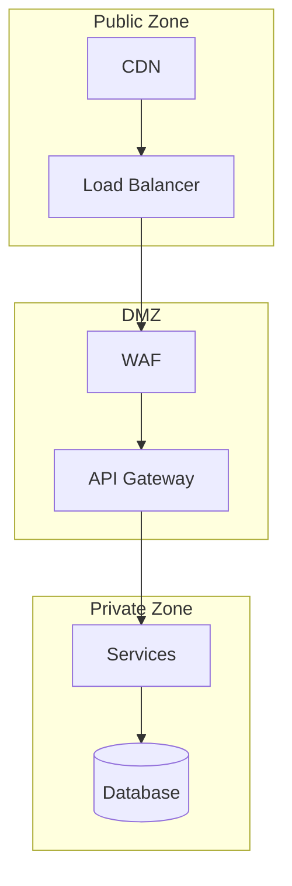

<!-- Template T12: Architecture Diagram — Copy this file and customize -->
<!-- sections:
  required: [Context Diagram, Component Diagram, Data Flow]
  recommended: [Technology Stack, Deployment View, Security Boundaries]
  optional: [Performance Considerations, Evolution Roadmap]
-->
# [System Name] — Architecture

!!! info "Document Metadata"
    | Field | Value |
    |-------|-------|
    | **Owner** | [team/person] |
    | **Status** | [draft/review/approved] |
    | **Last reviewed** | [YYYY-MM-DD] |
    | **Scope** | [what this diagram covers] |

## Context Diagram

High-level view: how the system interacts with users and external systems.

| Actor / System | Interaction | Protocol | Notes |
|----------------|-------------|----------|-------|
| Users | [what they do] | HTTPS | [notes] |
| External Service 1 | [integration type] | REST API | [notes] |
| Admin | [management access] | SSH/HTTPS | [notes] |

## Component Diagram

Internal components and how they communicate.

| Component | Responsibility | Technology | Owner |
|-----------|---------------|------------|-------|
| API Gateway | Request routing, auth | [tech] | [team] |
| Service A | [core domain logic] | [tech] | [team] |
| Service B | [secondary domain] | [tech] | [team] |
| Database | Persistent storage | [tech] | [team] |

## Data Flow

How data moves through the system for key operations.

| Flow | Trigger | Path | SLA |
|------|---------|------|-----|
| [User action] | [event] | User → API → Service → DB | [latency target] |
| [Background job] | [schedule/event] | Queue → Worker → DB | [throughput target] |

## Technology Stack

| Layer | Technology | Version | Purpose |
|-------|-----------|---------|---------|
| Frontend | [framework] | [ver] | [why chosen] |
| Backend | [language/framework] | [ver] | [why chosen] |
| Database | [DB engine] | [ver] | [why chosen] |
| Cache | [cache engine] | [ver] | [why chosen] |
| Queue | [message broker] | [ver] | [why chosen] |
| Infrastructure | [cloud/on-prem] | — | [why chosen] |

## Deployment View

| Environment | Instances | Region/AZ | Notes |
|-------------|-----------|-----------|-------|
| Production | [count] | [region] | [HA setup] |
| Staging | [count] | [region] | [mirrors prod] |

## Security Boundaries

| Boundary | Controls | Notes |
|----------|----------|-------|
| Public → DMZ | WAF, rate limiting, TLS | [details] |
| DMZ → Private | Network ACL, auth tokens | [details] |
| Data at rest | Encryption (AES-256) | [details] |
