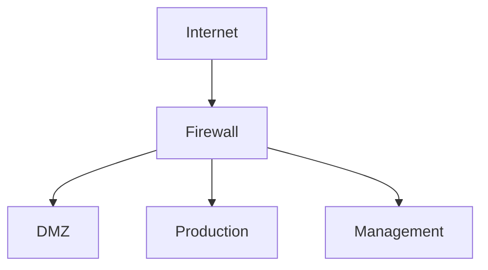

<!-- Template T5: Network Topology — Copy this file and customize -->
# Network Documentation: [Environment Name]

!!! info "Document Metadata"
    | Field | Value |
    |-------|-------|
    | **Environment** | [Environment Name] |
    | **Last Updated** | YYYY-MM-DD |
    | **Owner** | [team/person] |

## Topology Diagram

## VLAN Layout

| VLAN ID | Name   | Subnet       | Purpose | Gateway   |
| ------- | ------ | ------------ | ------- | --------- |
| [id]    | [name] | [x.x.x.x/xx] | [desc]  | [x.x.x.x] |

## Server Inventory

| Hostname   | IP   | OS           | Role   | VLAN | Owner  |
| ---------- | ---- | ------------ | ------ | ---- | ------ |
| [hostname] | [ip] | [os version] | [role] | [id] | [team] |

## Firewall Rules

| #   | Source   | Dest   | Port   | Proto | Action | Note   |
| --- | -------- | ------ | ------ | ----- | ------ | ------ |
| 1   | [source] | [dest] | [port] | TCP   | ALLOW  | [note] |

## Certificate Register

| Domain   | Issuer   | Expiry     | Auto-renew | Owner |
| -------- | -------- | ---------- | ---------- | ----- |
| [domain] | [issuer] | YYYY-MM-DD | ✅/❌        | [who] |

## DNS Records (Critical)

| Record   | Type | Value | TTL |
| -------- | ---- | ----- | --- |
| [domain] | A    | [ip]  | 300 |
