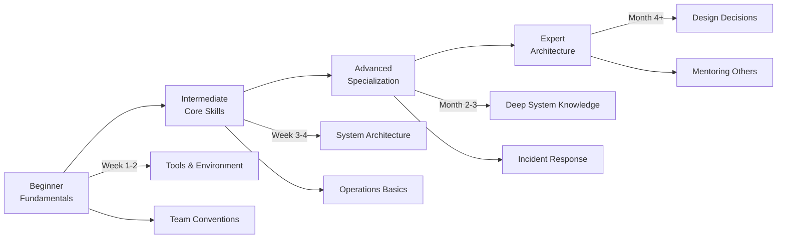

# Skill: Training & Guide Writer

## Viết tài liệu Training, Phát triển dự án & Hướng dẫn

**Agent:** 📝 [Documentation Agent]
**Source:** Adapted — [Google Developer Style Guide](https://developers.google.com/style), [gitlab.com/tgdp/templates](https://gitlab.com/tgdp/templates), [mkdocs-material](https://squidfunk.github.io/mkdocs-material/)

---

## Context / Bối cảnh

| Key          | Value                                                                                          |
| ------------ | ---------------------------------------------------------------------------------------------- |
| **Category** | docs                                                                                           |
| **Priority** | high                                                                                           |
| **Triggers** | Khi cần viết training docs, project specs, how-to guides, onboarding docs                      |
| **Output**   | Training material .md, ADR .md, how-to guide .md, quick reference .md                          |
| **Scope**    | IN: training, development docs, guides, reference cards. OUT: runbook, ops manual, deploy docs |

> Chuyên viết tài liệu training nội bộ, phát triển dự án, và hướng dẫn sử dụng. Mọi guide phải có Prerequisites → Steps → Expected Result.

---

## ⛔ THE IRON LAW

**Every guide MUST have Prerequisites → Steps → Expected Result → Troubleshooting — skip any = incomplete.**

---

## 🛡 Guardrails

- [ ] Target audience được xác định rõ (beginner / intermediate / advanced)
- [ ] Prerequisites listed — reader biết cần gì trước khi bắt đầu
- [ ] Screenshots/diagrams up-to-date — match current UI/system
- [ ] Tested by non-author — ít nhất 1 người khác đọc hiểu được

---

## 🎯 Khi nào dùng Skill này

```text
User request
  ├── Viết training / onboarding docs?
  │     └── YES → Dùng skill này (Section 1)
  ├── Viết ADR / project development docs?
  │     └── YES → Dùng skill này (Section 2)
  ├── Viết how-to guide / tutorial?
  │     └── YES → Dùng skill này (Section 3)
  ├── Tạo quick reference / cheat sheet?
  │     └── YES → Dùng skill này (Section 4)
  └── Viết runbook / ops docs?
        └── NO  → Xem ops-runbook-writer.md
```

| Dùng skill này khi...         | KHÔNG dùng khi...              |
| ----------------------------- | ------------------------------ |
| Viết training material mới    | Viết runbook vận hành          |
| Tạo onboarding docs cho team  | Document network topology      |
| Viết project architecture ADR | Viết incident response SOP     |
| Tạo how-to guide step-by-step | Viết deploy/rollback procedure |

---

## 1. Training Material

### 1.1 Training Document Template

```markdown
# Training: [Module Name]

| Field                   | Value                               |
| ----------------------- | ----------------------------------- |
| **Audience**            | [Junior/Mid/Senior] + [Role]        |
| **Duration**            | [Estimated time]                    |
| **Prerequisites**       | [Skills/tools cần có]               |
| **Learning Objectives** | [Sau khi hoàn thành, learner sẽ...] |

## Module Content

### Lesson 1: [Topic]

**Concepts:**
- Key concept 1 — giải thích ngắn gọn
- Key concept 2 — kèm ví dụ

**Hands-on Lab:**
1. Step 1 — `command hoặc action`
   - Expected result: `output mong đợi`
2. Step 2 — tiếp tục...

**Knowledge Check:**
- [ ] Learner có thể giải thích concept 1?
- [ ] Learner hoàn thành lab thành công?

### Lesson 2: [Topic]
[...]

## Assessment
| Criteria        | Pass Condition        |
| --------------- | --------------------- |
| Lab completion  | 100% steps pass       |
| Knowledge check | ≥ 80% correct         |
| Practical demo  | Can perform task solo |
```

### 1.2 Onboarding Checklist Template

```markdown
## Onboarding: [Role Name]

### Week 1 — Foundation
- [ ] Account setup: email, Slack, VPN, Git
- [ ] Read: Architecture overview → `docs/development/architecture/`
- [ ] Read: Team conventions → `docs/guides/conventions.md`
- [ ] Lab: Setup local development environment
- [ ] Meet: 1-on-1 with team lead

### Week 2 — Deep Dive
- [ ] Read: System operations → `docs/operations/runbooks/`
- [ ] Lab: Deploy to staging (with mentor)
- [ ] Lab: Debug a sample issue (guided)
- [ ] Read: Security policies → `docs/guides/security.md`

### Week 3 — Autonomy
- [ ] Task: Fix a real P4 bug independently
- [ ] Task: Write 1 runbook entry (reviewed)
- [ ] Present: Quick demo of work to team
- [ ] Feedback: 1-on-1 review with mentor
```

### 1.3 Learning Path Design



---

## 2. Project Development Docs

### 2.1 Architecture Decision Record (ADR) Template

```markdown
# ADR-[NNN]: [Decision Title]

| Field         | Value                                                    |
| ------------- | -------------------------------------------------------- |
| **Status**    | Proposed / Accepted / Deprecated / Superseded by ADR-XXX |
| **Date**      | YYYY-MM-DD                                               |
| **Author**    | [Name]                                                   |
| **Reviewers** | [Names]                                                  |

## Context
[Vấn đề hoặc cơ hội dẫn đến decision này]

## Decision
[Decision cụ thể đã chọn]

## Alternatives Considered
| Option         | Pros                 | Cons         |
| -------------- | -------------------- | ------------ |
| Option A       | [ưu điểm]            | [nhược điểm] |
| **Option B** ✅ | [ưu điểm — chọn này] | [nhược điểm] |
| Option C       | [ưu điểm]            | [nhược điểm] |

## Consequences
- **Positive:** [Lợi ích]
- **Negative:** [Trade-offs chấp nhận]
- **Risks:** [Rủi ro cần monitor]
```

### 2.2 Technical Spec Template

```markdown
# Technical Spec: [Feature Name]

## Overview
- **Goal:** [1-2 câu mục tiêu]
- **Scope:** [IN scope / OUT of scope]

## Design
### Architecture Diagram
```mermaid
[diagram]
```

### Data Flow
1. [Step 1] → [Step 2] → [Step 3]

### API Contracts (nếu có)
| Endpoint        | Method | Request         | Response      |
| --------------- | ------ | --------------- | ------------- |
| `/api/resource` | POST   | `{ name: str }` | `{ id: int }` |

## Implementation Plan
- [ ] Phase 1: [description] — ETA: [date]
- [ ] Phase 2: [description] — ETA: [date]

## Testing Strategy
| Test Type   | Coverage Target | Tool        |
| ----------- | --------------- | ----------- |
| Unit        | > 80%           | Jest/Pytest |
| Integration | Critical paths  | Supertest   |
| E2E         | Happy path      | Playwright  |

## Rollout Plan
- [ ] Deploy to staging → verify
- [ ] Canary deploy 10% → monitor 1h
- [ ] Full deploy → post-deploy checks
```

---

## 3. How-to Guides

### 3.1 Guide Structure (Google Style)

```markdown
# How to [Complete Task]

> **Audience:** [Who is this for]
> **Time:** ~[X] minutes
> **Difficulty:** ⭐ Beginner / ⭐⭐ Intermediate / ⭐⭐⭐ Advanced

## Prerequisites
- [ ] [Tool/access cần thiết 1]
- [ ] [Tool/access cần thiết 2]

## Steps

### Step 1: [Action verb + object]

[Giải thích ngắn tại sao step này cần thiết]

```bash
command-to-run --flag value
```

**Expected result:**
```
output mong đợi
```

!!! tip
    [Mẹo hữu ích cho step này]

### Step 2: [Action verb + object]
[...]

## Verify
- [ ] [Cách kiểm tra kết quả đúng]
- [ ] [Second verification point]

## Troubleshooting

??? warning "Error: [Common error message]"
    **Cause:** [Nguyên nhân phổ biến]
    **Fix:** [Cách sửa step-by-step]

## Next Steps
- [Related guide 1](link)
- [Related guide 2](link)
```

### 3.2 Good / Bad Examples

```markdown
<!-- ✅ GOOD — có prerequisites, steps rõ ràng, expected result -->
## Prerequisites
- Node.js ≥ 18 installed
- Git configured with SSH key

### Step 1: Clone the repository
```bash
git clone git@github.com:org/project.git
cd project
```
**Expected result:** Directory `project/` created with `package.json` inside.

<!-- ❌ BAD — thiếu prerequisites, không có expected result -->
### Setup
Clone the project and install dependencies.
Then configure the environment variables and start the server.
```

---

## 4. Quick Reference Cards

### 4.1 Cheat Sheet Template

```markdown
# [Tool/System] — Quick Reference

## Essential Commands
| Action     | Command          | Example              |
| ---------- | ---------------- | -------------------- |
| [Action 1] | `command [args]` | `command --flag val` |
| [Action 2] | `command [args]` | `command --flag val` |

## Keyboard Shortcuts (nếu có)
| Action | Shortcut       |
| ------ | -------------- |
| Save   | `Ctrl+S`       |
| Search | `Ctrl+Shift+F` |

## Common Patterns
```bash
# Pattern 1: [description]
command pattern here

# Pattern 2: [description]
command pattern here
```

## Glossary
| Term     | Definition                     |
| -------- | ------------------------------ |
| [Term 1] | [Giải thích ngắn gọn, ≤ 20 từ] |
| [Term 2] | [Giải thích]                   |
```

---

## 5. Doc Review Process

### 5.1 Peer Review Checklist

Trước khi merge doc vào main branch:

- [ ] **Accuracy:** Technical content verified by SME
- [ ] **Clarity:** Đọc hiểu được bởi target audience (non-expert test)
- [ ] **Completeness:** Prerequisites + Steps + Expected Result + Troubleshooting
- [ ] **Format:** markdownlint pass, heading hierarchy correct
- [ ] **Freshness:** Screenshots/diagrams match current UI
- [ ] **Links:** Tất cả internal/external links hoạt động

### 5.2 Versioning Strategy

```markdown
<!-- Trong YAML header của mỗi doc -->
---
version: "1.2"
status: approved         # draft → review → approved → archived
changelog:
  - "1.2 (2026-03-26): Updated Step 3 for new UI"
  - "1.1 (2026-03-15): Added troubleshooting section"
  - "1.0 (2026-03-01): Initial release"
---
```

> 📖 **Template library đầy đủ** → [doc-templates-library.md](references/doc-templates-library.md)

---

## ✅ Pre-delivery Checklist — Training/Guide Docs

Trước khi báo "done", verify:

- [ ] Target audience specified — beginner/intermediate/advanced
- [ ] Prerequisites listed — reader biết cần gì
- [ ] Mọi step có expected result — reader verify được
- [ ] Screenshots match current UI — không outdated
- [ ] Tested by non-author — ít nhất 1 người đọc hiểu
- [ ] Tất cả links valid — internal + external

---

## 🚩 Red Flags — STOP

| Action                             | Problem                                             |
| ---------------------------------- | --------------------------------------------------- |
| Guide không có expected result     | → Reader không biết đúng/sai → hỏi lại = waste time |
| Missing target audience definition | → Quá đơn giản hoặc quá phức tạp cho reader         |
| Copy-paste từ guide cũ             | → Verify content match current version              |
| Screenshots từ 3+ months ago       | → Re-capture nếu UI đã thay đổi                     |
| Training without hands-on lab      | → Lý thuyết alone = low retention                   |

---

## Remember

| Rule                 | Description                                            |
| -------------------- | ------------------------------------------------------ |
| **4-part structure** | Prerequisites → Steps → Expected Result → Troubleshoot |
| **Audience first**   | Define audience TRƯỚC khi viết bất kỳ content nào      |
| **Hands-on labs**    | Training PHẢI có lab — theory alone = 10% retention    |
| **Active voice**     | "Click Save" not "Save should be clicked"              |
| **Non-author test**  | Ít nhất 1 người khác đọc hiểu trước khi publish        |
| **Version control**  | YAML header: version, status, changelog                |

## 🔗 Related Skills

| Khi cần...                       | Xem skill                              |
| -------------------------------- | -------------------------------------- |
| Setup MkDocs, markdown standards | `docs-engineer.md`                     |
| Viết runbook / ops docs          | `ops-runbook-writer.md`                |
| Copy-paste doc templates         | `references/doc-templates-library.md`  |
| MkDocs plugins recommendation    | `references/mkdocs-plugins-catalog.md` |

<!-- Used: 2026-03-26 -->
